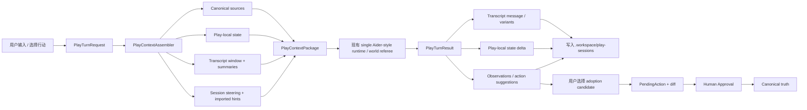

# OpenTavern 两套参考实现对 OAN Play Mode 的优化分析

> 分析范围：`reference-only/HajimidesOpenTavern`、`reference-only/PawNzZiOpenTavern`，以及 OAN 当前 Play Mode 的规格、core、backend、client、Vue UI 和测试。
>
> 分析方式：本地静态阅读；未运行两个参考项目，也未调用其远程 API、公共角色卡服务、WebLLM、TTS 或 ComfyUI。
>
> 结论性质：产品与架构参考，不代表允许复制参考项目代码、prompt、角色卡或视觉资产。
>
> 分析日期：2026-07-10。

## 结论摘要

两套 OpenTavern 对 OAN 的价值不在其单文件架构、浏览器存储或 provider 配置，而在于它们已经把“角色聊天”打磨成了一个连续、可操作、可观察的 Play 循环。

OAN 当前 Play Mode 已经有正确的安全底座：

- Play session 与 canonical truth 分离。
- session 文件只写入 `.workspace/play-sessions/`。
- adoption 进入 PendingAction，不直接修改章节、状态、时间线或伏笔。
- 使用单一 world referee，不引入重型多 Agent runtime。
- Tavern-compatible 导入内容被视为不可信输入。

但当前产品闭环还没有真正接通。最重要的静态代码证据是：

1. `packages/backend` 已有 `world-referee-turn` endpoint，但 `packages/client` 没有对应方法，`PlayModeTab.vue` 也没有调用入口。
2. `formatPlayWorldRefereePrompt()` 只输出 session id、scene、persona、角色名和 activated source 元数据；它没有把历史 transcript、play-local state、source 实际内容或 session steering 送入模型。
3. 每次 world-referee 请求都创建新的 agent turn 上下文，当前请求里也没有完整 Play 历史，因此连续对话会丢失关键上下文。
4. Vue UI 只能手工 append transcript，不能流式生成、停止、重试或选择候选回复。
5. UI 没有展示 activated sources、omitted sources、play-local state 或 observations，也不能配置 source activation。
6. 后端 world-referee turn 只追加一条统一标记为 `world-referee` 的文本，不会解析角色发言、叙事段、状态变化、观察或行动建议。
7. adoption candidate 需要用户手填底层 JSON payload，暴露了内部工具参数，不是作者友好的 adoption workflow。
8. `transcript.md` 与 `session.yaml.transcript` 同时保存 transcript，但读取时实际只读 `session.yaml`，存在双表示与潜在漂移。

因此，优化顺序不应先做 TTS、图片、主题或本地模型，而应先补齐以下五项：

1. 把 Play 从狭窄的右侧 review panel 提升为独立主工作区。
2. 建立真实的 `PlayContextPackage`，把 transcript window、summary、play-local state 和已激活 source 内容装配进每个回合。
3. 接通 client/UI 的流式 world-referee turn、停止、重试和错误恢复。
4. 为多角色回合增加明确的 speaker identity、手动指定与轻量调度。
5. 将“候选行动、Play observation、state delta、adoption suggestion”做成结构化且可审阅的 turn result。

## 分析基准

### 参考项目快照

| 项目 | 本地 HEAD | 提交时间 | 主要结构 | 许可证证据 |
|---|---|---|---|---|
| `HajimidesOpenTavern` | `fb1ee71e273ab56d8d8011698e332e814e139ab6` | 2026-07-08 12:06:21 +08:00 | `index.html` 约 16,651 行 / 838 KB，另有 TTS Worker、公共卡 API 和内置 cards | 仓库 `LICENSE` 与 README 均声明 AGPL-3.0 |
| `PawNzZiOpenTavern` | `d085a6de5e59243ea9da250cbc09930b46c5ca39` | 2026-06-05 09:29:03 +08:00 | `index.html` 约 8,848 行 / 417 KB，另有 README | README 声明 MIT，但当前分析树没有独立 `LICENSE` 文件 |

许可证与来源边界：

- `HajimidesOpenTavern` 只能学习产品模式、数据流和抽象思想，不应复制代码、prompt 文本、角色卡或 UI 文案。
- `PawNzZiOpenTavern` 的 README 虽声明 MIT，但本地快照缺少独立许可证文件，而且两个项目的代码演进关系未在本次分析中完成法律溯源。为降低风险，OAN 仍应独立实现，不直接搬运代码或 prompt。
- 两个项目都把大量业务、状态、UI 和 provider 逻辑塞进单个 HTML。这个形态适合便携 demo，不适合 OAN 的 monorepo、Vue、backend、client、core 分层。

### OAN 当前上下文图谱

| 类型 | 文件 | 与本分析的关系 |
|---|---|---|
| 稳定规格 | `docs/PLAY_MODE_SPEC.md` | 定义 Play / Writing 边界、session 文件、activated sources 和 adoption 边界 |
| 任务 | `docs/tasks/1060.md` | Play core 与 Tavern import 的已完成范围 |
| 任务 | `docs/tasks/1090.md` | UI、world referee、observation 和 adoption 的目标与完成声明 |
| 实施计划 | `docs/superpowers/plans/2026-06-19-play-mode-tavern-import.md` | Play session 与 import 设计步骤 |
| 实施计划 | `docs/superpowers/plans/2026-06-19-play-mode-ui-adoption-workflow.md` | backend/client/UI/world referee/adoption 计划 |
| Core | `packages/core/src/play-session.ts` | session schema、文件读写、world referee prompt |
| Backend | `packages/backend/src/index.ts` | session routes、world-referee turn、adoption-to-PendingAction |
| Client | `packages/client/src/index.ts` | Play lifecycle API；当前缺少 world-referee API |
| UI | `apps/desktop-ui/src/components/workspace/PlayModeTab.vue` | 当前右侧 Play panel |
| UI 容器 | `apps/desktop-ui/src/components/workspace/WorkspaceRightPanel.vue` | 证明 Play 当前只是 review panel 的一个 tab |
| 测试 | `__test__/core/src/play-session.test.ts` | 路径安全、session 文件和 prompt 基础测试 |
| 测试 | `__test__/backend/src/backend.test.ts` | create、append transcript 和 adoption PendingAction 测试 |
| 测试 | `__test__/client/src/client.test.ts` | create 与 adoption client 路由测试 |

本分析只新增当前文档，不修改上述实现或 task 状态。

## 两套 OpenTavern 的共同优点

### 1. 把“回合”做成即时反馈循环

两套实现都提供了完整聊天反馈链：

- 发送后立即进入 generating 状态。
- 通过流式 token 更新当前气泡。
- 生成期间显示停止按钮。
- 完成后增量追加消息，避免整页重绘。
- 仅在用户接近底部时自动滚动，用户阅读历史时不强制跳到底部。
- 错误后恢复输入状态。

OAN 当前 backend 的 world-referee turn 是一次性 JSON 响应，UI 甚至没有调用它。对 Play 体验而言，“先等完整结果，再刷新整个 session”会明显削弱沉浸感。

可吸收方式：

- 复用 OAN 已有 RuntimeEvent / SSE 流，不在 frontend 直接调用模型。
- 增加 Play turn 专用 client stream adapter。
- UI 支持 `idle -> submitting -> streaming -> post-processing -> complete/error/cancelled` 状态。
- 流式正文与最终持久化结果必须由同一 turn id 对齐，避免重复追加。

### 2. 消息是可操作对象，不只是静态文本

两套实现都提供 copy、edit、regenerate、delete；Hajimides 还处理了主回复与第二阶段回复之间的 parent-child 关系。

这些动作提升了 Play 的试错速度，但原实现通常直接修改或删除历史消息。OAN 不宜照搬这种破坏式操作，应转译成：

- `retry`：为同一个 parent turn 生成新 variant，旧 variant 继续保留。
- `select variant`：只改变 Play session 的选中路径，不进入 canonical truth。
- `edit and fork`：从编辑后的用户输入建立 checkpoint / branch，而不是覆盖旧证据。
- `delete`：优先标记 hidden / superseded；真正清理 session artifact 由用户显式执行。

这样既保留 OpenTavern 的快速试错体验，也符合 OAN 的 trace、evidence 和 Git 审批哲学。

### 3. 多角色场景有轻量发言控制

两套实现都支持：

- 新建聊天时多选角色。
- 用 `@角色名` 或选择面板指定本轮回复角色。
- 没有 `@` 时根据最近发言者或轮转策略决定下一位。
- 每条 assistant 消息保存 speaker，用于渲染与后续调度。
- 只把本轮重点角色作为主要发言焦点，降低角色混淆。

这与 OAN 已确定的“single world referee + character voice/state modules”方向高度一致。它证明多角色体验不需要引入多 Agent runtime。

OAN 可吸收为三种第一版策略：

| 策略 | 行为 | 适用场景 |
|---|---|---|
| `manual` | 用户在 composer 上方选择本轮主要角色 | 精确对白试跑，建议默认 |
| `natural` | 根据点名、当前场景、最近发言者和参与度选择 | 沉浸式自由 Play |
| `roundRobin` | 按参与角色顺序轮转，可跳过 muted 角色 | 会议、队伍轮流表态 |

调度结果必须记录在 turn trace 中，不能只存在运行时临时字段。

### 4. World Info 是“按需上下文”，不是整本世界观常驻 prompt

两套实现的 World Info activation 都包含较完整的机制：

- primary key 和 secondary key。
- AND ANY / AND ALL / NOT ANY / NOT ALL。
- constant entry。
- 角色名 / tag filter。
- scan depth。
- probability。
- 一层递归触发。
- inclusion group 与 group winner。
- sticky / cooldown / delay。
- position / depth 注入。
- token budget 与预算截断提示。
- activation cache。

其中最值得 OAN 吸收的不是完整字段，而是三个产品原则：

1. 只加载本回合相关 source。
2. 用户能知道加载了什么、为什么加载、哪些因预算被省略。
3. 上下文预算是可见约束，不是隐藏截断。

OAN 已经有 `PlayActivatedSource` 的 `sourceId`、`path`、`reason`、`budgetLayer`、`semanticBoundary` 和 `trust`，但目前只是元数据容器。下一步应实现真正的 `PlayContextAssembler`。

第一版不建议吸收：

- 随机 probability，因其降低可复现性。
- 任意 regex 直接执行，因其可能带来性能与安全问题。
- 复杂递归、outlet、任意 depth 注入。
- sticky / cooldown / delay 的全量 Tavern 兼容语义。

第一版建议只做确定性的：

- entity / alias / tag / hook id 触发。
- 可选 secondary trigger。
- `always` 与 `onMention` 两种策略。
- source priority、estimated tokens、included / omitted。
- 每回合 context package 与 activation trace。

### 5. 长对话记忆有明确的“原文保留、prompt 压缩”边界

两套实现都支持：

- 自动 summary。
- 手动按最近 N 轮或自定义范围 summary。
- summary 历史、编辑、删除。
- summary 覆盖范围。
- 原始聊天继续在 UI 可见，但已 summary 的历史不再重复进入 prompt。
- 上下文压力条和截断提示。

这与 OAN 的 filesystem-first 很适配。建议新增 Play-local summary artifact：

```text
.workspace/play-sessions/<session-id>/
  summaries.yaml
```

每条 summary 至少记录：

- `id`
- `coveredTurnIds`
- `summary`
- `createdAt`
- `model`
- `evidenceHash`
- `supersedes`
- `canonical: false`

summary 只能压缩 Play transcript，不能成为 canonical summary。summary 进入回合 prompt 时也必须显示在 context inspector 中。

### 6. Prompt / context 可见性显著提升可调试性

两套实现都有 full prompt viewer，并用 context bar 告知用户当前消息数量与上限。

OAN 不应直接复制“显示最终字符串 prompt”的产品形态，而应优先显示结构化 `PlayContextPackage`：

- protected：constitution、明确世界规则、当前 canonical state。
- compressible：旧 Play summary、远期背景、低相关 transcript。
- play-local：session steering、play-local state、选中 variant。
- untrusted：Tavern interaction hints、imported lorebook、外部 preset。
- omitted：未命中或因预算省略的 source。

高级模式可以再展示最终 messages，但必须：

- 不显示 API key 或 provider secret。
- 明确标记每段内容的来源和 trust。
- 不把模型私有 reasoning 当作可观察 trace。

### 7. 长历史 UI 有性能意识

两套实现默认只渲染最近一段消息，支持向上加载更早历史；Hajimides 版本还更细致地保留滚动位置。

OAN 的 Play transcript 未来可能远长于普通右侧面板列表。独立 Play 工作区应使用：

- windowed / virtualized transcript。
- 稳定 turn id 作为 key，不能继续使用 `speaker + createdAt`。
- 流式时只更新当前 turn。
- 回看历史时不强制滚到底部。

## HajimidesOpenTavern 的增量启发

`HajimidesOpenTavern` 在 PawNzZi 版本的基本聊天能力上继续增加了多项功能。对 OAN Play Mode 价值最高的是以下四项。

### 1. 两阶段生成：正文之后再生成行动选项

Hajimides 可以在主回复完成后，再用第二次请求生成 2–4 个结构化行动选项，并把第二阶段消息与主消息通过 `parentId` 关联。第二阶段可以独立重试或删除。

可吸收的不是其 XML prompt，而是“主叙事与辅助决策分离”的交互模式。

OAN 可改造为：

- 主阶段：世界裁判输出叙事与角色回复。
- 辅助阶段：可选生成下一步行动建议、observation 和 play-local state delta。
- UI 将 action suggestion 渲染成可点击 chip；点击后只填入 composer 或发起下一回合，不自动写 canon。
- 辅助阶段可单独重试，不影响主回复。
- 默认可以关闭，避免隐藏增加延迟与成本。

更理想的接口不是自由文本或 XML，而是类型化结果：

```ts
type PlayTurnAuxiliary = {
  suggestions: Array<{
    id: string;
    label: string;
    action: string;
  }>;
  observations: Array<{
    summary: string;
    evidenceTurnIds: string[];
  }>;
  proposedLocalStateDelta?: Record<string, unknown>;
};
```

### 2. 折叠状态栏

Hajimides 会识别模型输出中的 HTML `<details>` 状态栏，并用 DOMPurify 限制标签和属性后渲染。

OAN 可以吸收“场景 HUD”概念，但不应让模型输出 HTML。应直接用结构化 `playLocalState` 渲染：

- 当前地点 / 时间。
- 在场角色。
- 角色可见情绪。
- 关系张力。
- 当前目标。
- 已激活线索。
- 非 canonical 标识。

状态变化由模型提出 delta，经过 schema validation 后写入 Play-local state。它不需要 PendingAction，因为只在 `.workspace/play-sessions/` 内；但必须有 turn evidence 和可回滚 checkpoint。

### 3. Persona 与 session steering 分离

Hajimides 增加了 user description、第一阶段 post-history instructions、第二阶段 prompt 和第二阶段 post-history 配置。

OAN 不应开放能覆盖 constitution 的任意系统 prompt，但可以吸收其作用域意识：

- `persona`：用户在 Play 中扮演谁。
- `scene steering`：本场景临时节奏、视角、禁区和目标。
- `character interaction hints`：角色 voice / reaction 提示。
- `auxiliary policy`：是否生成选项、观察和 state delta。

这些配置都应带 source、scope、trust 和 expiry，不能成为无来源的全局 prompt。

### 4. PNG 角色卡、TTS、图像、WebLLM 和性能模式

Hajimides 还实现了：

- PNG `chara` / `ccv3` 角色卡读取。
- OpenAI-compatible / Fish Audio / browser speech TTS。
- ComfyUI 本地生图并把图片挂到消息附件。
- WebLLM 本地推理。
- UI theme 和 low-power mode。
- 公共角色卡浏览与 Cloudflare API。
- SillyTavern prompt preset 导入。
- 模型 reasoning / CoT 展示。

对 OAN 的判断：

| 能力 | 建议 | 原因 |
|---|---|---|
| PNG 角色卡 | 已吸收，无需重复规划 | `packages/core/src/tavern-card.ts` 已支持 PNG metadata |
| TTS | P2 可选 | 能提升沉浸感，但不解决当前 Play 闭环问题 |
| 场景图 / 角色立绘 | P2 可选 | 可作为 session attachment，不能成为 canon |
| WebLLM | 不作为 Play 专项 | 属于全局 provider / privacy 能力，应独立决策 |
| low-power mode | 低优先级 | OAN 当前是桌面 IDE，且尚无重 WebGL 背景 |
| 公共角色卡服务 | 不吸收 | 违反现有“不自动抓取分享站点角色卡”边界，并带来版权与内容审核负担 |
| SillyTavern preset | 不直接吸收 | 任意 prompt 可能覆盖 constitution，也扩大不可信输入面 |
| CoT / reasoning 展示 | 不吸收 | 不稳定、provider-specific，也不应替代 OAN 的 context trace |

## 推荐的 OAN 化 Play 回合架构

OpenTavern 的优势应被转译进 OAN 现有分层，而不是引入第二套聊天 runtime。



### `PlayTurnRequest`

建议包含：

- `sessionId`
- `userText`
- `requestedSpeakerId?`
- `speakerStrategy`
- `parentTurnId?`
- `retryOfTurnId?`
- `checkpointId?`
- `generateSuggestions`
- `generateObservations`

### `PlayContextPackage`

建议包含：

- session scene / persona / participants。
- constitution 与不可覆盖规则。
- selected canonical source 内容。
- activated interaction hints / lorebook 内容。
- play-local state。
- transcript recent window。
- Play summaries。
- session steering。
- included / omitted source 清单。
- estimated token budget。
- 每段内容的 trust 与 semantic boundary。

这里必须修复当前只传 source 元数据、不传 source 内容的问题。

### `PlayTurnResult`

建议使用结构化 envelope，而不是只返回一段 `world-referee` 文本：

```ts
type PlayTurnResult = {
  turnId: string;
  messages: Array<{
    kind: 'narrator' | 'character';
    speakerId?: string;
    content: string;
  }>;
  suggestions?: Array<{
    id: string;
    label: string;
    action: string;
  }>;
  proposedLocalStateDelta?: Record<string, unknown>;
  observations?: Array<{
    id: string;
    summary: string;
    evidenceTurnIds: string[];
    canonical: false;
  }>;
  contextTraceId: string;
};
```

这样可以解决当前所有模型回复都显示为 `world-referee`、角色身份不可追踪的问题。

## 文件模型建议

当前 session layout 可以保留，但需要明确结构化 source 与人类可读 projection 的关系。

当前 `writePlaySessionFiles()` 会把 transcript 同时写入 `session.yaml` 和 `transcript.md`，而 `readPlaySessionFiles()` 只从 `session.yaml` 读取。建议明确一种权威模型：

```text
.workspace/play-sessions/<session-id>/
  session.yaml                 # session metadata / config，不重复保存所有 turn
  turns.yaml                   # Play-local 结构化 turn source of truth
  transcript.md                # 由 turns.yaml 生成的人类可读 projection
  play-local-state.yaml
  activated-sources.yaml
  summaries.yaml
  observations.yaml
  adoption-candidates.yaml
  variants.yaml
  checkpoints.yaml
  steering.md
  traces/
    <turn-id>.context.yaml
```

如果暂时不新增 `turns.yaml`，至少应选择 `session.yaml.transcript` 或 `transcript.md` 其中一个作为唯一 source of truth，并明确另一个是 projection，避免用户编辑 Markdown 后读取结果不一致。

所有这些仍是 Play-local session artifact，不是小说 canonical truth。

## UI 改造建议

### 1. Play 应成为主工作区，而不是右侧 review tab

`WorkspaceRightPanel.vue` 的职责是 file、diff、approval、health、Git 和 reference review。当前把 Play 放在这里，导致：

- transcript 宽度不足。
- composer、角色选择、流式状态和历史浏览拥挤。
- adoption candidate 表单与聊天混在同一窄列。
- Play 在产品结构上仍像附属工具，与 `PLAY_MODE_SPEC.md` 的“与 Writing Mode 并列”不一致。

建议布局：

```text
左侧：Play sessions / checkpoints
中间：主 transcript / streaming turn / composer / action suggestions
右侧：scene HUD / activated sources / context budget / observations / adoption
```

Writing Mode 和 Play Mode 可以共享 workspace shell、provider gate、pending action review 与底层 runtime，但主内容区应切换。

### 2. 新建 session 改为引导式入口

当前表单要求直接输入 title、scene、persona 和逗号分隔角色。建议分成：

1. 选择 canonical 起点：章节结尾、时间线事件、地点或自定义 scene。
2. 选择 persona / POV。
3. 多选在场角色。
4. 预览自动激活的 source 与预算。
5. 确认 Play-local / non-canonical 边界后开始。

### 3. Composer 增加轻量控制

建议只暴露高价值控制：

- 主要回复角色选择器 / `@` mention。
- `manual / natural / roundRobin` 策略。
- 临时 steering。
- 生成 / 停止。
- 是否生成行动建议。

不要把 temperature、top-p、prompt position、depth、provider preset 等 power-user 参数堆进 Play 主界面。

### 4. Adoption 从 JSON 表单改为向导

当前 UI 要求作者填写类似 `{"chapterId":"...","content":"..."}` 的 payload。建议改为：

- 从 observation、turn 或选中 transcript 自动创建 candidate。
- 用户选择目标：章节素材 / state / timeline / foreshadow。
- UI 根据目标显示领域表单。
- 自动带入 evidence turn ids 与原文摘录。
- 最后预览将调用的 write-intent 与目标文件。
- 创建 PendingAction 后切换到现有 diff / approval UI。

## 建议吸收矩阵

| 参考能力 | OAN 当前状态 | OAN 化建议 | 优先级 |
|---|---|---|---|
| 流式回复 / Stop | backend 有非流式 route，client/UI 未接 | 复用 RuntimeEvent/SSE，提供 Play turn stream | P0 |
| Full prompt viewer | 无 Play context inspector | 展示结构化 context package、trust、included/omitted | P0 |
| transcript continuity | 文件存在，但不进入 world-referee prompt | recent window + summaries + selected checkpoint | P0 |
| activated lore | 只有元数据 schema | 确定性轻量 activation + 实际内容 + budget trace | P0 |
| 多角色 `@` | session 只有角色名数组 | speaker id、manual selector、natural/roundRobin | P0 |
| Play main workspace | 当前是右侧 tab | 升级为独立主内容区 | P0 |
| 状态栏 HUD | 有 playLocalState 文件但无 UI/更新链 | schema 化 scene HUD + proposed delta | P1 |
| 消息重试 | 无 | 保留旧回复，生成 variant | P1 |
| branch / checkpoint | 无 | Play-local checkpoint，不等同 Git branch | P1 |
| summary manager | 无 | summaries.yaml + evidence range + prompt pruning | P1 |
| 第二阶段选项 | 无 | 可选 action suggestions，点击填入 composer | P1 |
| observation 自动提取 | backend 只支持手工添加 | turn 后结构化生成，用户审阅后再建 candidate | P1 |
| adoption UI | 手填 JSON | 领域向导 + evidence + diff preview | P1 |
| 长历史窗口化 | 简单列表 | virtualized/windowed transcript | P1 |
| TTS | 无 | 可选 session playback | P2 |
| 场景图 / 立绘 | 无 | Play-local attachment，不自动入 canon | P2 |
| WebLLM | 无 Play 专项 | 若需要，作为全局 provider 能力独立规划 | 不在本任务 |
| OPFS | 不适用 | 继续使用 filesystem-first session files | 不吸收 |
| 公共角色卡库 | 明确禁止自动抓取 | 保持本地显式导入 | 不吸收 |
| 任意 ST preset | imported prompt 已视为不可信 | 不允许覆盖 constitution；不做通用 preset runtime | 不吸收 |
| CoT 展示 | 无 | 用 context trace / tool trace 代替 | 不吸收 |

## 分阶段实施建议

### P0：先让 Play 真正“能玩”

目标：一个用户可以在独立 Play 工作区连续完成多轮模型互动。

交付建议：

- client 增加 world-referee turn API / stream。
- Play UI 接入生成、停止、错误恢复。
- world-referee 收到 transcript window、play-local state 和实际 source 内容。
- 每回合保存稳定 turn id、speaker id 和 context trace。
- UI 展示角色、场景、non-canonical 状态与 activated source。
- Play 使用主工作区布局。

验收建议：

- 第二轮生成能引用第一轮已发生内容。
- 关闭或重新打开 app 后 session 可继续。
- 指定角色后，结果保存明确 speaker id。
- 用户能看到本回合 included / omitted sources。
- 取消流式生成不会留下半条持久化 transcript。
- canonical files 保持不变。

### P1：让 Play 适合长会话与剧情探索

目标：支持长期连续性、试错、分支和作者可用的观察结果。

交付建议：

- summary manager。
- variants / retry / select。
- checkpoints / fork from turn。
- manual / natural / roundRobin speaker strategy。
- action suggestions。
- structured play-local state delta。
- structured observation extraction。
- adoption wizard。

验收建议：

- retry 不删除旧回复。
- fork 后两个分支有独立 selected path 和 play-local state。
- summary 覆盖范围可追溯到 turn ids。
- observation 必须带 evidence turn ids。
- state delta 只更新 Play-local state。
- adoption 仍只创建 PendingAction。

### P2：增强沉浸感

目标：在核心闭环稳定后增加可选表现层能力。

候选：

- TTS 朗读。
- 场景图、角色头像和情绪参考图。
- 视觉小说式布局。
- Play session 导出包。
- 全局本地模型 provider。

这些能力都不应改变 canonical truth 与 Human Approval 边界。

## 对现有 task 状态的建议

按 `docs/tasks/1090.md` 的 Done Criteria 和当前代码静态证据，建议后续把 1090 重新按 `Needs Review` 复核，而不是直接在其上叠加沉浸功能。主要原因：

- world referee route 未接入 client/UI。
- UI 未展示 activated sources、observations 或 play-local state。
- UI 只能手工 append turn，不是实际模型 Play。
- world-referee turn 没有持久化结构化 observations。
- activated source 在 UI 创建流程中不可配置。
- 缺少 world-referee route、连续上下文和 UI 交互测试。

这不否定 1060/1090 已完成的基础设施；相反，它说明现有安全边界与 API 骨架已经足够好，下一步应集中补产品闭环，而不是重做底层架构。

## 不建议照搬的实现模式

### 单文件应用架构

两个参考项目把 UI、存储、provider、prompt、World Info、TTS 和渲染混在一个 HTML 中。OAN 应继续保持：

- `packages/core`：Play schema、context assembly 纯逻辑、session filesystem helper。
- `packages/agent`：Play prompt/message assembly 与 model adapter。
- `packages/runtime`：已有 Aider-style loop，不增加 Play 专属第二套 runtime。
- `packages/backend`：session-scoped route / SSE。
- `packages/client`：transport API。
- `apps/desktop-ui`：主 Play workspace 与 review panels。

### OPFS / localStorage 作为主要数据层

OAN 已经有更适合长期小说工程的 filesystem-first 方案。Play session 应继续是 Markdown / YAML 文件，并由 Git 可选地追踪用户确认后的正式结果。

### 任意 prompt override

参考项目允许全局 system prompt、post-history instructions 和 SillyTavern preset 覆盖角色 prompt。OAN 必须坚持优先级：

```text
constitution / canonical world rules
  > explicit user Play request
  > canonical character facts
  > session steering
  > imported interaction hints / lorebook / preset
```

不可信 imported content 只能作为带 provenance 的低优先级 context，不能改变上层规则。

### 模型生成 HTML 或暴露 CoT

场景 HUD、选项和状态变化应由 JSON schema / typed output 表达。不要依赖模型生成 HTML，也不要把 provider reasoning 当成 OAN 的可解释性方案。OAN 应展示 source trace、tool trace、context budget 和决策理由摘要。

### 直接编辑或删除 transcript 历史

参考项目的 edit/delete/regenerate 会原地改变 conversation。OAN 应用 variant、superseded、checkpoint 和 fork 表达试错，保留 evidence chain。

## 最终判断

两套 OpenTavern 确实有不少可以吸收的优点，但应该吸收的是“Play 产品循环”，不是其代码组织或完整 Tavern power-user 面板。

最有价值的组合是：

```text
OpenTavern 的即时聊天体验、上下文预算、多角色控制和长会话记忆
    +
OAN 已有的 Play-local filesystem、source discipline、PendingAction 和 Human Approval
    =
可连续游玩、可追溯、可试错、但不会污染小说事实源的 Play Mode
```

如果只能做一个后续增量，应优先实现：

> 独立 Play 主工作区 + 流式 world-referee turn + `PlayContextPackage`。

这是其他所有优化的前提。没有它，TTS、立绘、选项卡、summary 或多角色面板都只能装饰一个尚未真正连续运行的 Play shell。

## 参考文件

### OAN

- `docs/PLAY_MODE_SPEC.md`
- `docs/IMPORT_TAVERN_COMPATIBLE_CHARACTER_CARD.md`
- `docs/tasks/1060.md`
- `docs/tasks/1090.md`
- `docs/superpowers/plans/2026-06-19-play-mode-tavern-import.md`
- `docs/superpowers/plans/2026-06-19-play-mode-ui-adoption-workflow.md`
- `packages/core/src/play-session.ts`
- `packages/core/src/tavern-card.ts`
- `packages/backend/src/index.ts`
- `packages/client/src/index.ts`
- `apps/desktop-ui/src/components/workspace/PlayModeTab.vue`
- `apps/desktop-ui/src/components/workspace/WorkspaceRightPanel.vue`
- `__test__/core/src/play-session.test.ts`
- `__test__/backend/src/backend.test.ts`
- `__test__/client/src/client.test.ts`

### Reference-only

- `reference-only/PawNzZiOpenTavern/README.md`
- `reference-only/PawNzZiOpenTavern/index.html`
- `reference-only/HajimidesOpenTavern/README.md`
- `reference-only/HajimidesOpenTavern/LICENSE`
- `reference-only/HajimidesOpenTavern/index.html`
- `reference-only/HajimidesOpenTavern/worker.js`
- `reference-only/HajimidesOpenTavern/functions/api/card.js`
