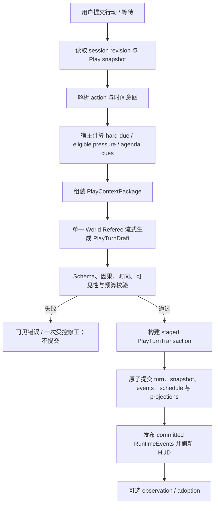

# Play Mode 世界事件升级计划

> 状态：Planned
>
> 文档目标：把 Play Mode 从“角色对话沙盒”升级为“角色、时间、场景与外部世界共同推进的互动小说沙盒”。
>
> 产品层级：Play 与 Writing 是 workspace 内同层级的顶级功能；Play 不是 Writing 右侧面板中的 tab。
>
> 适用范围：OAN 顶级模式导航、Play session、world referee、Play-local state、桌面端 Play 工作区、checkpoint / variant、observation / adoption；不改变 canonical truth 的审批边界。
>
> 分析日期：2026-07-10。

## 1. 结论摘要

Play Mode 下一阶段不应只是让更多角色轮流说话，而应让每个回合都可能推动一个持续运行的故事世界：时间流逝、NPC 在场外行动、组织推进计划、天气和地点发生变化、期限逼近、物品或证据转移、关系和资源产生后果。

升级后的核心公式是：

```text
Play Mode
  =
单一 World Referee
  + Character Voice / State Modules
  + 确定性的到期事件与压力评估
  + 结构化 PlayTurnDraft
  + Play-local Turn Transaction
  + 可见的世界状态、事件与来源
  + Observation -> PendingAction Adoption
```

这里的“世界会自己变化”不等于后台常驻 Agent 或按现实时间偷偷运行：

- 世界只在用户提交行动、明确等待、推进时间或恢复一个 session 时结算。
- NPC 与组织的自主性表达为 agenda、pressure、scheduled event 和 world rule，不表达为长期运行的独立 Agent。
- 模型负责理解、叙述与提出结构化变化；宿主负责触发评估、校验、排序、事务提交和恢复。
- 所有变化先属于 Play-local truth；只有用户选择 adoption，并通过现有 PendingAction / diff 审批后，才可进入真实小说文件树。

产品信息架构同样是本次升级的硬约束：

- Workspace 顶级导航提供 `Writing | Play`。
- Writing 进入现有 Novel Agent / files / diff / approval 工作台。
- Play 进入独立的 session / transcript / world HUD / event / adoption 工作台。
- 当前右侧 `Play` tab 只是待迁移的过渡实现，不是后续扩展容器。
- Play 内部仍可有右侧 inspector，但关闭 inspector 不等于退出 Play。

本升级由 `docs/tasks/1120.md` 独立追踪，不把世界事件范围悄悄并入原 `1090` 历史。`1090` 保留 UI / adoption 复核记录，`1120` 记录已落地纵向切片与后续事务、stream、checkpoint 范围。

### 1.1 当前实施进度

第一阶段纵向切片已经落地：

- Play 已成为与 Writing 同层级的顶级工作区，并从 Writing right tabs 移除。
- session schema v3 已提供 revision、world clock、event policy、typed world events 与 `events.yaml`，并以 `turns/*.yaml` 保存结构化回合事实、以 `selectedTurnIds` 选择 transcript projection 路径。
- client / backend 已接通真实 world-referee turn；referee 只使用 read tools。
- Play turn 已升级为专用 SSE：正文以 provisional delta 输出，中间 read-tool loop 通过 `play.narrative.reset` 清除旧 provisional block，结构化 settlement fence 保留在服务端；响应头预先提供 turn id，显式 Stop 与断流恢复通过 turn registry、cancel endpoint 与 commit barrier 确认 cancelled 或 committed truth。
- prompt 已加载最近 transcript、Play-local state、既有事件和 activated source 实际内容。
- narrative + 必需的 `oan-play-settlement` 通过宿主的 schema、事件预算和 cause reference 校验后才写入；无效 settlement 不产生部分回合。
- session 已采用 staged directory snapshot、ready marker、swap 与读取恢复；同 session 的所有 Play-local mutation 共享锁和 revision conflict 检查。
- hidden event 的 state、observation 与 adoption provenance 已统一标记，spoiler 关闭时不会从 HUD / adoption 旁路泄露。
- activated sources 与 referee read tools 已增加 realpath workspace containment，重复 session id 与未来 schema 会被拒绝。
- v1 / v2 -> v3 的 Core migration preview、原始 snapshot 备份、未知顶层 session metadata 保留和 migration history 延续已落地。
- UI 已提供 committed transcript、真实 provisional block、Stop / cancel / failed / conflict / indeterminate 状态、action kind、suggestions、HUD、visible / hidden event feed、source/state、observation 和 adoption candidate 表单；Play 组件统一使用共享黑白中性设计 token。
- 根目录 `__test__/desktop-ui` 已建立，首批覆盖 stream reducer、terminal 幂等、cancel / commit race 与中性设计契约；组件级和浏览器级覆盖仍需扩展。

尚未完成的 Phase 2+ 能力继续由 `docs/tasks/1120.md` 追踪：产品层 migration confirmation、事务 fsync / 跨进程锁 / 完整故障注入、schedule / pressure / agenda evaluator、checkpoint / variant、canonical drift / context trace、summary / windowing 与更完整的 UI 自动化。

## 2. 规划依据与参考边界

### 2.1 已阅读资料

OAN 文档：

- `docs/PLAY_MODE_SPEC.md`
- `docs/SILLYTAVERN_REFERENCE_LESSONS.md`
- `docs/INKOS_REFERENCE_LESSONS.md`
- `docs/INKOS_REFERENCE_OVERVIEW.md`
- `docs/OPENTAVERN_PLAY_MODE_REFERENCE_ANALYSIS.md`
- `docs/tasks/1060.md`
- `docs/tasks/1090.md`

本地参考项目：

| 项目 | 本次阅读基准 | 重点阅读 |
|---|---|---|
| `reference-only/SillyTavern` | `8172dcd0ee672d3cd9a5e5f7af134f91a45cd2b8` | World Info activation、timed effects、group activation、variables、bookmarks、应用事件总线 |
| `reference-only/inkos` | `d316c8e4fee9cf8f3b1dc8d8d5dd07967e129825` | play model、runner、reducer、store、agent prompts、HUD、checkpoint / variant、测试 |

以上结论来自本地静态阅读，不代表运行验证，也不代表允许复制参考实现的代码、prompt、文案或视觉资产。

### 2.2 两类参考各自解决什么

| 来源 | 最值得吸收 | 不应误读或照搬 |
|---|---|---|
| SillyTavern | 动态 lore 激活、群聊发言调度、Play-local 变量、checkpoint / branch、用户 steering、快速试错 | `eventSource` 是应用生命周期事件总线，不是故事世界事件系统；World Info 的 sticky / cooldown / delay 主要控制 prompt 激活，不等于世界时间；不复制 AGPL 代码或 prompt |
| InkOS | 行动解释、时间推进、NPC / 场外变化、结构化 mutation、render-before-commit、HUD、checkpoint / variant | 不引入四 Agent pipeline、SQLite 事实源、JSON event sourcing、后台自治 Agent；不复制 AGPL 代码或 prompt |
| OpenTavern | 流式 Play 闭环、消息操作、多角色轻量调度、context viewer、行动建议 | 不采用单 HTML / OPFS 架构、任意 preset、公共角色卡依赖、浏览器直连 provider |

三者在 OAN 中的组合边界是：

```text
SillyTavern / OpenTavern：怎么玩、怎么试、怎么控制上下文
InkOS：一个回合怎样让世界发生变化并完成结算
OAN：变化怎样保持 filesystem-first、可追溯，并在人工审批后进入真实作品
```

### 2.3 许可证边界

SillyTavern 与本地 InkOS 参考均按 AGPL 项目对待。本计划只吸收产品模式、领域概念、状态机思想和测试场景。实现时必须独立命名、独立建模、独立编写代码与 prompt，不复制源文件、prompt 片段、UI 文案或视觉资产。

## 3. 当前问题

OAN 已经具备正确的 Play / canonical 边界，但当前模型仍接近“在一个 session 中追加角色消息”：

1. transcript 是主要体验，外部世界变化没有一等数据模型。
2. `play-local-state.yaml` 是自由形态对象，缺少事件原因、世界时间、可见性和变更证据。
3. world referee prompt 没有形成完整的 transcript、state、activated source、due event 上下文包。
4. backend 虽有 world-referee endpoint，client 与 UI 没有接通真正的流式生成闭环。
5. 回合结果没有统一的“正文 + 时间 + 事件 + 状态变化 + observation”结构。
6. 多个 session 文件直接写入，失败时缺少 Play 回合级事务与恢复机制。
7. checkpoint / variant 尚不足以同时回退世界状态、事件计划、隐藏变化与 transcript 路径。
8. UI 没有世界时钟、事件流、压力、NPC / 组织 agenda、来源与 spoiler 控制。
9. `session.yaml.transcript` 与 `transcript.md` 存在双表示风险，需要明确一个结构化事实源和一个展示投影。

如果只在现有 prompt 中增加一句“让世界更有活力”，模型会制造不可复现、不可解释、无法回退的随机变化。升级必须同时覆盖领域模型、回合协议、事务、界面与测试。

## 4. 产品目标与非目标

### 4.1 产品目标

1. Play 作为与 Writing 同层级的顶级模式占据完整主工作区，不受限于 Writing 右侧面板。
2. 即使玩家只聊天或等待，世界也可以基于已有原因继续推进。
3. NPC、组织、地点、环境、期限和信息传播可以在场内或场外发生变化。
4. 每个外部事件都有来源、原因、世界时间、可见性和影响引用。
5. 作者可以看到“发生了什么”和“为什么发生”，也可以关闭 spoiler 查看沉浸视角。
6. 取消、失败、重试、切换 variant 和恢复 checkpoint 时，不留下半个回合的状态。
7. session 重开后能从文件恢复，不依赖进程内隐藏状态或私有数据库。
8. Play 产生的好结果可以带证据进入 adoption，但不能绕过 PendingAction。

### 4.2 非目标

- 不做后台常驻世界模拟或现实时间 cron。
- 不做每个角色一个 Agent 的多 Agent 社会。
- 不把完整物理模拟、经济模拟或规则引擎作为第一版目标。
- 不使用 SQLite、向量数据库或内存状态作为 Play 的唯一事实源。
- 不把事件 ledger 设计成重型 event sourcing；当前 snapshot 仍是恢复世界的主要事实。
- 不让 Play 直接修改 `chapters/`、`state/`、`timeline/`、`foreshadow/` 等 canonical 文件。
- 不实现任意表达式、任意 JavaScript、正则脚本或用户插件式触发器。
- 不暴露或保存模型私有 reasoning；只保存可解释的结构化 reason、source 和 validation trace。

## 5. 目标体验

### 5.1 一个典型回合

```text
当前世界：午夜前必须把证据交给报社；反派组织正在封锁车站。

玩家：我和林秋继续在咖啡馆讨论，不急着离开。

Play 结算：
1. 对话继续，林秋表现出犹豫。
2. 世界时间推进 35 分钟。
3. “车站封锁”压力跨过阈值，组织成员在场外控制了东侧入口。
4. 一名目击者因等待过久而离开，这是玩家暂时不知道的 hidden event。
5. HUD 显示截止时间缩短、可见的封锁消息和关系变化。
6. 后续玩家到达车站或收到电话时，hidden event 通过 consequence link 被揭示。
```

这不是随机插曲。封锁来自已有 faction agenda，目击者离开来自 deadline / pressure，时间变化来自本回合行动。

### 5.2 三种世界活跃度

`session.yaml` 应提供简单、可解释的事件策略：

| 模式 | 行为 | 建议用途 |
|---|---|---|
| `conversation` | 除明确行动后果和硬性到期事件外，不主动增加场外变化 | 纯对白试演 |
| `reactiveWorld` | 世界根据时间、压力、agenda 和玩家行动作出反应 | 默认 |
| `activeWorld` | 允许更多场外变化、组织行动和环境推进，但仍受事件预算与因果约束 | 高动态冒险 / 悬疑 |

事件密度单独配置为 `quiet | balanced | volatile`，用于控制 eligible pressure event 的数量，不得取消硬性到期事件。

## 6. 领域模型

### 6.1 核心术语

| 术语 | 含义 |
|---|---|
| Turn | 从一次玩家输入到 Play-local 原子提交的一次结算 |
| World Event | 已发生、可追溯的世界变化，不等同于一段叙事文本 |
| Scheduled Event | 在确定条件满足时必须进入结算的事件计划 |
| Pressure | 正在累积或逼近的威胁、机会、期限、追踪、舆论或关系张力 |
| Agenda | NPC 或组织的目标、下一步倾向和当前阻碍，不是独立 Agent |
| State Snapshot | 当前 Play-local 世界状态，是恢复的主要事实 |
| Turn Artifact | 一次已提交回合的结构化记录，用于审计、projection、checkpoint 与 adoption 证据 |
| Observation | Play 中值得进入正式创作流程的候选事实或灵感，不是 canonical truth |

### 6.2 外部事件类型

第一版使用有限枚举，不开放任意事件 DSL：

```ts
type PlayWorldEventKind =
  | 'environmentChanged'
  | 'locationChanged'
  | 'npcActed'
  | 'factionActed'
  | 'arrival'
  | 'departure'
  | 'deadlineAdvanced'
  | 'resourceChanged'
  | 'itemMoved'
  | 'evidenceChanged'
  | 'relationshipChanged'
  | 'informationSpread'
  | 'ruleConsequence'
  | 'manual';
```

该枚举可以扩展，但每次扩展都应有 reducer、UI 和测试语义，不能只让模型自由造字符串。

### 6.3 事件来源与因果

```ts
type PlayEventOrigin =
  | 'player'
  | 'npc'
  | 'faction'
  | 'clock'
  | 'environment'
  | 'worldRule'
  | 'manual';

interface PlayEventCause {
  sourceTurnIds?: string[];
  sourceEventIds?: string[];
  triggerId?: string;
  pressureId?: string;
  agendaId?: string;
  ruleSourceRef?: string;
  reason: string;
}
```

校验规则：

- 除 opening seed 与 `manual` 外，事件至少要有一个可定位的 cause reference。
- `reason` 是给作者看的简短解释，不是 chain-of-thought。
- 随机性只能影响同等 eligible 事件的选择，不能替代因果来源；默认第一版不启用随机选择。
- 事件造成的每项 state delta 都必须能回指 event id。

### 6.4 事件可见性

```ts
type PlayEventVisibility =
  | 'playerVisible'
  | 'rumor'
  | 'playerUnknown';

interface PlayEventKnowledge {
  visibility: PlayEventVisibility;
  knownByEntityIds: string[];
  revealedAtTurnId?: string;
  revealedByEventId?: string;
}
```

- `playerVisible`：可以立即进入 transcript / event feed。
- `rumor`：玩家知道有信息流动，但其真实性可以不确定。
- `playerUnknown`：只进入 referee context 和作者 spoiler inspector，不能泄露到沉浸视角。
- hidden event 后续被揭示时，必须记录 `revealedByEventId`，不能直接修改旧记录伪装成一直可见。

### 6.5 世界时间

世界时间同时需要语义表达与确定性顺序：

```ts
interface PlayWorldClock {
  turn: number;
  revision: number;
  anchor?: string;
  elapsed?: string;
  order: number;
}

interface PlayTimeAdvance {
  from: PlayWorldClock;
  to: PlayWorldClock;
  elapsed: string;
  rationale: string;
}
```

设计原则：

- `turn` / `revision` / `order` 必须单调，用于并发校验和确定性排序。
- `anchor` 与 `elapsed` 可以是自然语言，但若世界 contract 声明了可解析日历，才允许做绝对时间比较。
- “说一句话”和“穿越城市”不能默认消耗同样时间；时间推进由动作语义决定并受宿主校验。
- InkOS 的 `synchronized` 概念不保留为几条说明字符串，而升级为同一时间区间内的多个一等 `PlayWorldEvent`。

### 6.6 Scheduled Event

第一版只支持有限、可验证的触发器：

```ts
type PlayEventTrigger =
  | { type: 'nextTurn' }
  | { type: 'afterTurns'; turns: number }
  | { type: 'flagEquals'; path: string; value: string | number | boolean }
  | { type: 'atWorldTime'; value: string }
  | { type: 'manual' };
```

约束：

- `atWorldTime` 只在 world contract 提供规范化时间格式时启用。
- 不支持任意表达式、脚本、正则或循环触发。
- 到期 trigger 由宿主确定，不由模型自行声称“还没到”。
- scheduled event 可被明确取消或改期，但必须写入原因和来源 turn。

### 6.7 Pressure 与 Agenda

```ts
interface PlayPressure {
  id: string;
  kind: 'deadline' | 'pursuit' | 'factionProject' | 'environment' | 'rumor' | 'relationship';
  label: string;
  status: 'latent' | 'active' | 'resolved';
  level?: number;
  threshold?: number;
  causeRefs: string[];
  nextConsequence?: string;
  visibility: PlayEventVisibility;
}

interface PlayAgenda {
  id: string;
  ownerEntityId: string;
  goal: string;
  nextMove?: string;
  blockers: string[];
  status: 'active' | 'blocked' | 'completed' | 'abandoned';
  visibility: PlayEventVisibility;
  updatedAtTurnId: string;
}
```

`level` 只在世界 contract 明确允许数字化时使用。纯文学场景可以只保留 status、next consequence 和自然语言依据，避免把一切游戏化为数值条。

### 6.8 World Event

```ts
interface PlayWorldEvent {
  id: string;
  turnId: string;
  sequence: number;
  kind: PlayWorldEventKind;
  origin: PlayEventOrigin;
  title: string;
  summary: string;
  actorEntityIds: string[];
  targetEntityIds: string[];
  locationEntityId?: string;
  worldTime: PlayWorldClock;
  knowledge: PlayEventKnowledge;
  cause: PlayEventCause;
  stateDeltaRefs: string[];
  status: 'occurred' | 'cancelled';
  canonical: false;
}
```

### 6.9 PlayTurnDraft 与 PlayTurnArtifact

模型提出 `PlayTurnDraft`，宿主校验并提交后生成 `PlayTurnArtifact`：

```ts
interface PlayTurnDraft {
  baseRevision: number;
  messages: Array<{
    role: 'narrator' | 'character';
    speakerEntityId?: string;
    content: string;
  }>;
  timeAdvance: PlayTimeAdvance;
  events: PlayWorldEvent[];
  scheduledEventChanges: unknown[];
  pressureChanges: unknown[];
  agendaChanges: unknown[];
  stateDeltas: unknown[];
  observations: unknown[];
  suggestedActions: string[];
  contextTraceId: string;
}

interface PlayTurnArtifact extends PlayTurnDraft {
  id: string;
  revision: number;
  input: { kind: 'say' | 'look' | 'move' | 'do' | 'wait'; raw: string };
  committedAt: string;
  validationSummary: string[];
  canonical: false;
}
```

实际实现必须用 Zod / JSON Schema 收紧 `unknown` 部分；此处只保留规划层级，避免提前冻结全部 patch 细节。

## 7. 三层事件结算机制

外部变化应分成三层，不能全部交给模型自由发挥。

### 7.1 第一层：Hard Due Event

满足确定触发条件的 scheduled event：

- 必须进入当前回合结算。
- 宿主先生成 due event skeleton，再交给 referee 结合场景叙述与补全影响。
- referee 若遗漏、取消或改期，必须提供符合规则的结构化原因；否则 draft 校验失败。

### 7.2 第二层：Eligible Pressure Event

由 active pressure、agenda、时间推进和世界模式共同决定的候选事件：

- 宿主计算 eligible list 和本回合 event budget。
- referee 可以选择 0 到 N 个实现，但每个都必须引用 pressure / agenda。
- `conversation` 通常只处理强制后果；`reactiveWorld` 处理紧密相关候选；`activeWorld` 可处理更多场外候选。

### 7.3 第三层：Immediate Consequence

由玩家本回合行为直接产生的即时结果：

- 必须引用当前 turn 或同 turn 前序 event。
- 可以创建新的 pressure / scheduled event。
- 不能用“世界本来就这样”跳过因果说明。

### 7.4 事件预算

每个 session 配置：

```yaml
eventPolicy:
  simulationMode: reactiveWorld
  density: balanced
  allowOffscreen: true
  allowHidden: true
  maxExternalEventsPerTurn: 2
```

预算只限制 eligible / spontaneous event；hard due event 不被静默丢弃。若同一回合到期事件过多，应按优先级全部记录，并允许叙事层合并表达，而不是删除状态变化。

## 8. 回合执行与事务

### 8.1 目标流程



### 8.2 单 World Referee

不照搬 InkOS 的 interpreter、mutator、renderer、reconciler 四 Agent。OAN 使用一个 turn-scoped referee：

- character voice / state 是上下文模块，不是独立运行 Agent。
- 宿主先提供确定性的 due events、eligible pressures 和规则约束。
- referee 一次提出叙事与结构化结算。
- reducer 只执行通过 schema 与领域规则校验的 delta。
- 对可自动修复的格式错误，最多进行一次可观察的 correction；不得构造隐藏的无限重试循环。

### 8.3 流式正文与最终提交

- `messages[].content` 可以向 UI 发送 provisional delta，提升沉浸感。
- provisional 内容不等于已提交 transcript。
- 同一 turn 在中间 read-tool loop 后重新开始正文时，服务端发送 `play.narrative.reset`；UI 清空此前全部 provisional 文本，后续 delta 构造替代正文。reset 本身不产生事实、不推进 revision。
- 完整 `PlayTurnDraft` 到达并通过验证后，才生成 committed turn。
- UI 需要区分 `streaming` 与 `committed`；失败时撤回或标记未提交的 provisional block。
- 取消、provider error、schema error、revision conflict 都不得留下 transcript-only 或 state-only 的半回合。

具体 AI SDK 输出方式可以在实施计划中根据当前依赖版本选择，但必须保持同一个 turn id、同一个结构化 draft 和一次最终提交，不能让第二次模型调用偷偷重写第一次叙事的事实。

### 8.4 PlayTurnTransaction

当前多个 Play 文件的直接写入必须升级为回合级 staged transaction：

1. 获取 session 级互斥锁，确认 `baseRevision` 未变化。
2. 在 `.transactions/<transaction-id>/` 写入 manifest 和全部候选文件。
3. 校验 staged 文件可重新解析，且引用完整。
4. manifest 标记 `prepared`。
5. 用可恢复的替换过程 materialize 新 snapshot、turn artifact 和 projections。
6. manifest 标记 `committed`，再发布 `play.turn.committed`。
7. 启动或打开 session 时扫描未完成 transaction，按 manifest 回滚或补完。

必须覆盖的故障点：

- narrative 已流式显示但结构化 draft 未完成。
- turn artifact 写入成功而 state snapshot 失败。
- event ledger 更新成功而 transcript projection 失败。
- 应用在 `prepared` 与 `committed` 之间退出。
- 两个窗口对同一 session 同时提交。

由于这些文件都位于 `.workspace/play-sessions/`，Play-local 提交不需要 canonical PendingAction；但它仍必须是可观察、可恢复的内部写入。

## 9. Filesystem-first 存储设计

### 9.1 建议布局

```text
.workspace/play-sessions/<session-id>/
├── session.yaml
├── transcript.md
├── play-local-state.yaml
├── activated-sources.yaml
├── events.yaml
├── event-schedule.yaml
├── observations.yaml
├── adoption-candidates.yaml
├── summaries.yaml
├── steering.md
├── turns/
│   └── <turn-id>.yaml
├── checkpoints/
│   └── <checkpoint-id>/...
├── variants/
│   └── <parent-turn-id>/...
├── traces/
│   └── <turn-id>.context.yaml
└── .transactions/
    └── <transaction-id>/...
```

### 9.2 事实与投影边界

| 文件 | 角色 |
|---|---|
| `session.yaml` | session metadata、schema version、revision、policy、canonical base refs、selected branch head |
| `turns/*.yaml` | 已提交回合的结构化事实与证据 |
| `play-local-state.yaml` | 当前可恢复 snapshot；实体状态、clock、pressure、agenda、knowledge 等 |
| `events.yaml` | 按 turn / sequence 排列的事件 ledger，用于审计和 UI；不是重建全部状态的唯一来源 |
| `event-schedule.yaml` | 尚未发生、已取消或已改期的计划事件 |
| `transcript.md` | 从 selected turn path 生成的人类可读 projection，不是第二份可独立修改的 transcript truth |
| `traces/*.context.yaml` | source 选择、预算、omission 与规则来源；不保存私有 reasoning |

必须消除 `session.yaml.transcript` 与 `transcript.md` 的双写歧义：

- 新 schema 不再把完整 transcript 嵌入 `session.yaml`。
- `turns/*.yaml` 保存结构化消息，`transcript.md` 由 selected branch 投影生成。
- `play-local-state.yaml` 是当前状态主快照；events 提供因果与审计，不能把系统演变成必须全量 replay 的 event sourcing。

### 9.3 Canonical base 与漂移

`session.yaml` 应记录创建 / 上次 rebase 时的：

- Git HEAD（若存在）。
- 已激活 canonical source path 与内容 hash。
- 关键角色、世界规则和状态源的 hash。

继续 Play 前若发现 canonical source 已变化：

- 显示 stale source 提示。
- 允许继续使用旧 snapshot、重新装配 context 或从当前 canonical fork 新 session。
- 不静默把新 canonical 内容混入旧 session，造成不可解释的时间线漂移。

## 10. PlayContextPackage

每个回合必须装配真实内容，而不是只把 source 元数据列给模型。

```text
protected
  - constitution / world contract
  - 当前 canonical base 摘要与关键规则
  - 当前 Play clock、scene、state、hard-due events

play-local
  - session steering
  - selected transcript window
  - prior summaries
  - active pressures / agendas / event schedule
  - visible 与 referee-only knowledge

activated
  - 本回合命中的角色、地点、世界设定、时间线和伏笔原文片段

untrusted
  - Tavern card hints、外部 lorebook、导入 preset 建议

omitted
  - 未命中、过预算或低优先级 sources 及原因
```

复用现有 `ContextBudgetLayer`、semantic boundary、trust、selected / omitted source 和 context trace 机制。新增 Play-specific assembler，但不要在 `packages/runtime` 写领域逻辑。

规则优先级：

```text
Novel Constitution / explicit world contract
  > canonical source facts
  > Play-local committed state
  > session steering
  > imported Tavern hints / lorebook / preset
```

隐藏事件可以进入 referee-only context，但不得进入 player-visible transcript。context inspector 在作者 spoiler 模式下可以查看其结构化摘要与来源。

## 11. UI / UX 升级

Play 必须从狭窄的右侧 tab 提升为与 Writing 同层级的顶级主工作区。这不是“把右侧面板做宽”，而是改变 workspace 的一级信息架构。

### 11.1 顶级模式导航

```text
Workspace
├── Writing
│   ├── Novel Agent Copilot
│   ├── files / chapters
│   └── diff / approval / health inspector
└── Play
    ├── session / branch
    ├── scene / transcript / actions
    └── world HUD / events / context / adoption inspector
```

行为约束：

- 顶级 `Writing | Play` 切换位于 workspace 主导航，不属于 `WorkspaceRightPanel` tabs。
- 切换到 Play 时，主区域完整替换为 `PlayWorkspace`；不能在 Writing 中间区旁边仅打开一个 Play panel。
- `workspaceMode`、active Play session、selected branch 和 Play 内部布局状态按 workspace 恢复。
- 从 Play 生成的 adoption candidate 可以打开共享 approval / diff 能力，但这不会自动把顶级模式切回 Writing，也不会直接写 canonical 文件。
- Play 内部的 HUD / Event / Context / Adoption 可以是 inspector tabs；它们是 Play 子级导航，不得再次等同于顶级 Play 入口。

### 11.2 建议布局

```text
┌─────────────────────────────────────────────────────────────────────┐
│ Play session / branch / world time / streaming state / stop / retry │
├─────────────────┬──────────────────────────────┬────────────────────┤
│ Scene & Cast    │ Transcript / Narrative       │ World HUD          │
│ - 当前地点       │ - narrator                   │ - 世界时钟          │
│ - 在场角色       │ - character messages         │ - 最近事件          │
│ - speaker control│ - provisional stream         │ - active pressures  │
│ - source status  │ - variants / checkpoints     │ - agendas / changes │
│                 │ - action composer             │ - observations      │
├─────────────────┴──────────────────────────────┴────────────────────┤
│ Context / Event / Adoption inspector                                │
└─────────────────────────────────────────────────────────────────────┘
```

### 11.3 Event Feed

事件卡至少显示：

- 类型、世界时间、地点和涉及实体。
- `visible now`、`rumor` 或 `offscreen revealed later` 状态。
- 简短 cause；可展开查看 trigger / pressure / agenda / source refs。
- 关联 state deltas。
- 是否已生成 observation / adoption candidate。

沉浸模式默认不显示 `playerUnknown`。作者可显式开启 spoiler inspector；切换行为只改变 UI 可见性，不改变已提交知识状态。

### 11.4 World HUD

第一版 HUD 保持 genre-neutral：

- 世界时间与本回合 elapsed。
- 当前地点、在场角色与主要关系变化。
- active pressure / deadline。
- 最近 visible event 与已揭示的 offscreen event。
- 关键持有物、证据、资源；仅在世界 contract 声明时显示数值 meter。
- activated source / omitted source / stale source 提示。

不要把所有小说类型强制变成 RPG 数值面板。

### 11.5 Composer

- 行动类型：`say | look | move | do | wait`。
- 多角色时支持 `manual | natural | roundRobin` speaker strategy。
- “推进时间”应有明确入口，可填写“等十分钟”“等到天亮”等语义时间。
- 建议行动是可选辅助，不应阻塞自由输入。
- streaming 时提供 stop；完成后提供 retry、fork、select variant 和 checkpoint。

## 12. Backend、Client 与 RuntimeEvent

### 12.1 建议 endpoint

```text
POST /api/workspace/play-sessions/:id/turns/stream
POST /api/workspace/play-sessions/:id/turns/:turnId/retry
POST /api/workspace/play-sessions/:id/checkpoints
POST /api/workspace/play-sessions/:id/checkpoints/:checkpointId/restore
GET  /api/workspace/play-sessions/:id/events
GET  /api/workspace/play-sessions/:id/context-traces/:turnId
POST /api/workspace/play-sessions/:id/events/:eventId/adoption-candidates
```

现有 world-referee endpoint 可兼容一段时间，但新 client / UI 应围绕 turn stream 与 committed artifact，而不是“返回一段 assistant 文本”。

### 12.2 Play RuntimeEvent taxonomy

```text
play.turn.started
play.context.ready
play.narrative.delta
play.narrative.reset
play.turn.prepared
play.turn.committed
play.event.occurred
play.turn.failed
play.turn.cancelled
```

约束：

- `play.narrative.delta` 明确标记 provisional。
- `play.narrative.reset` 清除同一 turn 此前全部 provisional 正文；它不撤销 committed turn，也不推进 revision。
- 当前实现以 `play.turn.committed.session` 作为 transcript、world state、observation 与 event feed 的权威刷新载荷。
- 独立 `play.event.occurred` 属于 schedule / pressure / agenda evaluator 的后续交付，不是当前 UI 的事件刷新事实源；实现后也只能在 transaction 持久化 committed 后发布，不能把 draft 事件冒充已发生。
- event payload 只包含 UI 所需结构化 trace，不包含 provider secret 或私有 reasoning。
- 复用已有 RuntimeEvent / SSE / AI SDK UI stream 基础设施，不新建第二套通用 runtime。

## 13. Checkpoint、Variant 与重试

checkpoint 必须覆盖：

- selected turn head 与 transcript projection 输入。
- `play-local-state.yaml`。
- world clock、events、schedule、pressures、agendas。
- activated sources、summaries 与 knowledge / reveal 状态。
- session revision 与 canonical base refs。

行为规则：

- retry 从同一个 before-turn checkpoint 重新生成，旧结果保存为 variant。
- 选择 variant 会切换 Play-local selected path，并重新投影 transcript / state / event feed。
- 不物理删除未选中的事件；它们属于对应 variant，不属于当前 selected world。
- restore checkpoint 必须回退事件计划和隐藏知识，不能只截断聊天文本。
- checkpoint / variant 是 Play-local 分支，不自动创建 Git branch。

## 14. Observation 与 Canonical Adoption

世界事件提供比纯聊天更好的 adoption 证据。候选映射包括：

| Play 结果 | 可能的 canonical target |
|---|---|
| 可用叙事段 | chapter draft / scene section |
| 角色或关系变化 | `state/characters.yaml` 或对应对象文件 |
| 已验证的时间推进 | timeline entry |
| 新线索、证据或未兑现后果 | foreshadow / clue / evidence object |
| 世界规则的可靠发现 | world object / rule section |

adoption candidate 应自动携带：

- session id、turn id、event ids。
- source refs 与 canonical base hashes。
- before / after Play-local state 摘要。
- 建议 target 与 semantic patch intent。
- 可见性；hidden event 默认不自动建议 adoption，作者显式选择时除外。

后续仍走：

```text
Play observation / event
  -> adoption candidate
  -> write intent / SemanticPatch draft
  -> PendingAction + diff
  -> human accept / reject
  -> optional Git commit
```

任何 event、checkpoint、retry 或 session close 都不能直接写 canonical target。

## 15. 兼容与迁移

当前已落地 `schemaVersion: 3` 的 turn fact 与迁移基础：

1. 旧 session 继续可读。
2. Core 可在写入前生成 migration preview；第一次写入 v3 staged snapshot 时保存原始备份和 preview。backend / client / UI 的显式确认仍待实现。
3. 把旧 `session.yaml.transcript` 转换为 legacy turn artifacts。
4. 重新生成 `transcript.md` projection。
5. 保留未知顶层 session metadata，并让 `.migrations/` 历史跨后续保存延续；旧自由形态 local state 的进一步归一化仍待后续 schema 完成。
6. migration 与 v3 snapshot 在同一个 staged directory swap 中提交；更完整的 fsync、跨进程锁和逐故障点验证仍待实现。

不应在应用升级时批量静默重写全部 Play session。

## 16. 实施阶段

### Phase 0：现状复核与任务化

目标：先把已声明完成但实际未闭环的部分分开。

- 对照代码复核 `docs/tasks/1090.md` 的 client、stream、UI 和 adoption done criteria。
- 新建独立 Planned task，例如 `1120 Play World Events And Turn Transactions`。
- 将本计划链接为 Related Plan；不要直接改写旧任务历史。
- 更新 `docs/PLAY_MODE_SPEC.md`，冻结 v3 turn fact / projection 术语、事实边界和非目标。
- 把 `Writing | Play` 顶级模式导航和移除 `rightTab: 'play'` 写入 UI scope；不允许只升级现有 `PlayModeTab.vue`。

完成标准：实现团队知道哪些是旧 Play 缺口，哪些是本次 world-event 新能力。

### Phase 1：Core schema 与 migration

建议范围：

- 修改 `packages/core/src/play-session.ts`。
- 新增 `packages/core/src/play-world-event.ts`。
- 新增 `packages/core/src/play-event-trigger.ts`。
- 新增 `packages/core/src/play-turn-transaction.ts`。
- 从 `packages/core` 包入口导出稳定类型与 API。

交付：

- session v3 schema（turn artifact / selected path 基础；其余 world simulation schema 按后续阶段增量交付）。
- WorldEvent / Schedule / Pressure / Agenda / TurnArtifact schema。
- trigger evaluator、领域 validator、state reducer。
- legacy session reader / migrator。
- staged transaction 与 recovery。

### Phase 2：Play context 与单裁判回合

建议范围：

- 新增 `packages/agent/src/play-context.ts`。
- 新增 `packages/agent/src/play-turn.ts`。
- 复用现有 context package、source trace、agent stream 与 tool calling。

交付：

- PlayContextAssembler 加载实际 transcript / summary / state / event / source 内容。
- host-side due / eligible evaluator。
- 单 world referee 的结构化 PlayTurnDraft。
- provisional narrative stream + validated final draft。
- 一次受控 correction 与清晰失败状态。

约束：不修改 `packages/runtime` 让它理解 Play 领域，不增加多 Agent coordinator。

### Phase 3：Backend 与 client 闭环

当前状态：**部分完成**。turn stream、cancel、commit barrier 与类型安全 client adapter 已落地；retry、checkpoint / restore、独立 event / trace 查询及旧 endpoint deprecation 仍待完成。在 evaluator 与独立事件通知落地前，committed session 继续承担事件 feed 的权威刷新载荷。

建议范围：

- `packages/backend/src/index.ts`
- `packages/client/src/index.ts`
- 对应 backend / client 测试 workspace

交付：

- turn stream、cancel、retry、checkpoint、restore、event / trace 查询。
- revision conflict 与 transaction recovery 响应。
- client stream adapter 和类型安全 API。
- 旧 world-referee API 的兼容 / deprecation 路径。

### Phase 4：独立 Play 工作区与 HUD

建议组件：

```text
WorkspaceModeNavigation.vue
WritingWorkspace.vue
PlayWorkspace.vue
PlayTranscript.vue
PlayComposer.vue
PlayWorldHud.vue
PlayEventFeed.vue
PlayContextInspector.vue
PlayAdoptionDrawer.vue
```

交付：

- `Writing | Play` 顶级模式导航、可恢复的 `workspaceMode` 和独立主工作区布局。
- `WorkspaceToolbar` 的 Play 操作从 `openRightTab('play')` 改为切换顶级 mode。
- 从 `WorkspaceRightTab` / `WorkspaceRightPanel` 移除完整 Play Mode；共享 review panel 继续服务 Writing 与 adoption review。
- streaming / stop / error / committed 状态。
- 世界时钟、事件流、pressure、agenda、source trace。
- speaker strategy、wait / advance time。
- spoiler toggle、variant / checkpoint。

### Phase 5：Adoption、健壮性与文档收口

- event / observation 一键生成 adoption candidate。
- semantic target mapping 与 PendingAction evidence。
- canonical drift 提示与 session fork / rebase。
- recovery、并发、长 transcript 性能和 accessibility 测试。
- 更新 `docs/PLAY_MODE_SPEC.md`、任务状态、Implementation Notes 和 `docs/README.md` 索引。

## 17. 测试计划

测试继续放在仓库根目录 `__test__/<module>/`，通过包入口导入。

### 17.1 Core

- WorldEvent / Schedule / Pressure / Agenda schema round-trip。
- 无 cause 的事件被拒绝。
- world clock、revision、event sequence 单调。
- hard-due event 不受事件预算影响。
- `playerUnknown` 不进入 player-visible projection。
- hidden event reveal 保留原事件与 reveal link。
- trigger evaluator 对同一 snapshot 输出一致。
- invalid delta 不改变任何文件。
- staged transaction 在每个故障点可恢复 / 回滚。
- 两个相同 baseRevision 中只有一个可提交。
- checkpoint restore 同时恢复 state、events、schedule 与 knowledge。
- legacy session migration 保留未知字段和原始备份。

### 17.2 Agent

- context 包含真实 transcript window、summary、current state、due events 与 source 内容。
- omitted source 有预算原因。
- Tavern imported hint 不能覆盖 constitution / canonical rule。
- referee 输出必须引用宿主提供的 hard-due event。
- 场外事件不泄露到 player-visible narrative。
- 一次 turn 只有一个 final PlayTurnDraft。

### 17.3 Backend / Client

- stream event 顺序稳定。
- cancel 后没有 committed turn 或部分文件。
- provider error / parse error 不追加 transcript。
- revision conflict 返回可处理的冲突。
- 应用重开后能恢复 prepared transaction。
- client 能消费 provisional delta、committed artifact 与 world events。

### 17.4 UI

- transcript 只把 committed turn 视为事实。
- streaming block 在失败 / cancel 后正确处理。
- spoiler off 时不显示 hidden event。
- event feed 可追踪 cause 与 state delta。
- wait / advance time 能产生明确 action kind。
- branch / checkpoint 切换后 HUD 与 transcript 同步。
- 键盘操作、screen reader label、对比度和 reduced motion。

### 17.5 Adoption

- 生成 candidate 时自动附带 turn / event evidence。
- accept 前 canonical 文件保持不变。
- reject 不改变 Play session 已提交结果。
- source hash 变化时阻止静默套用旧 patch。

## 18. 端到端验收场景

1. 玩家选择等待两小时；world clock 推进，已到期的 NPC / faction 事件发生并进入 HUD。
2. 玩家一直聊天；一个已有 deadline 跨过阈值，场外世界发生可解释变化，而不是强制要求玩家先“触发剧情”。
3. 一个 `playerUnknown` 事件发生；当前 transcript 不泄露，后续通过有因果链接的新事件揭示。
4. 同一动作 retry；旧结果保留为 variant，新结果从相同 before-turn snapshot 开始。
5. restore checkpoint 后，后来发生的事件、schedule 变更、pressure 和角色知识一起回退。
6. 流式生成中取消；重新打开 session 时没有半条 transcript、半个状态或幽灵事件。
7. 在两个窗口同时提交；后提交者收到 revision conflict，不能覆盖先提交回合。
8. 关闭并重开应用；session 从 Markdown / YAML / turn artifacts 恢复完整世界。
9. canonical source 在 session 外发生变化；继续前出现 stale / rebase / fork 选择。
10. 作者把一个已发生事件 adoption 到 timeline / chapter；PendingAction accept 前真实文件无变化。
11. 相同 snapshot 与相同 trigger evaluator 输入得到同一 hard-due / eligible 集合。
12. `conversation`、`reactiveWorld`、`activeWorld` 三种模式的事件密度不同，但都不会吞掉硬性到期事件。

## 19. 风险与控制

| 风险 | 控制方式 |
|---|---|
| 模型滥造戏剧性事件 | cause 引用、三层结算、event budget、host validator |
| 状态与叙事矛盾 | 单一 PlayTurnDraft、render / validate before commit、state delta refs |
| 隐藏信息泄露 | knowledge projection 分层、player / referee context 分离、UI spoiler gate |
| 多文件半写入 | PlayTurnTransaction、revision lock、startup recovery |
| 事件系统演变为 event sourcing | snapshot 明确为恢复事实；ledger 只做审计、UI 与证据 |
| 多角色演变为多 Agent | 单 referee；speaker scheduler 与 agenda 只是确定性模块 |
| 数值化损害文学表达 | meter 可选；默认保留自然语言 pressure / agenda |
| 上下文无限增长 | transcript window、summary、source budget、context trace |
| Play 结果污染 canonical truth | `.workspace` 隔离、adoption candidate、PendingAction / diff |
| 参考代码许可证污染 | 只学模式；独立实现、独立 prompt、保留来源说明 |

## 20. 实施决策清单

开始写代码前必须确认以下决策已进入稳定规格：

- [x] `turns/*.yaml` 是结构化回合事实，`transcript.md` 是 projection。
- [ ] `play-local-state.yaml` 是当前 snapshot，events 不是唯一状态源。
- [ ] 外部世界只在显式 Play turn / time advance 时结算。
- [ ] 单 world referee，不引入 character agents 或 background agents。
- [ ] hard due / eligible pressure / immediate consequence 三层机制成立。
- [ ] event origin、cause、visibility、world time、delta refs 为必需字段。
- [ ] hidden event 的保存、投影、揭示与 adoption 规则明确。
- [ ] PlayTurnTransaction 的失败恢复和 revision conflict 行为明确。
- [x] provisional stream 与 committed turn 在 UI 上有清晰区别；Stop 通过服务端 cancel confirmation 与 commit barrier 处理。
- [ ] checkpoint / variant 覆盖状态、事件、计划、知识与 source refs。
- [ ] canonical adoption 继续经过 PendingAction / diff / human approval。

## 21. 最终建议

第一版优先完成“可解释、可回退、可提交的事件世界”，不要追求复杂模拟。最小但完整的交付应包含：

1. 世界时间、scheduled event、pressure / agenda 和 typed WorldEvent。
2. 一个加载真实 Play 上下文的单 world referee 回合。
3. provisional narrative + structured settlement + atomic Play-local commit。
4. 独立 Play 工作区中的世界时钟、事件流和 spoiler 控制。
5. 覆盖 turn、state、events、schedule 的 checkpoint / variant。
6. 带 event evidence 的 observation / adoption workflow。

做到这六点后，Play Mode 才真正从“角色在说话”升级为“一个故事世界在回应玩家，并且它发生过的变化都能被作者理解、试验、回退和采纳”。
