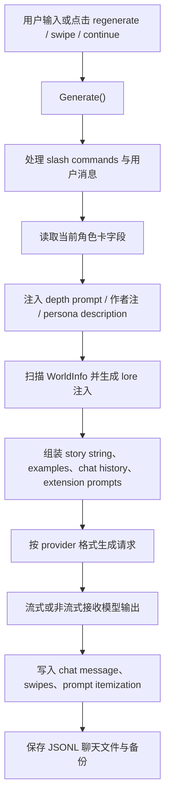

# SillyTavern 参考项目现状分析

> 范围：本文只分析 `reference-only/SillyTavern` 本地当前版本的实际代码与仓库文档，用于理解 SillyTavern 对角色扮演、角色卡、世界书和对话推进剧情的参考价值。  
> 基准：本地 `reference-only/SillyTavern` 当前 HEAD 为 `51ad27fb8`，提交日期为 2026-05-03，提交信息为 `Merge pull request #5591 from SillyTavern/staging`。本次为静态阅读，没有运行 SillyTavern 的测试或构建。  
> 许可证：`package.json` 标记为 `AGPL-3.0`。本文只讨论产品模式和抽象思路，不建议复制实现代码、prompt 文本或默认资产。

## 结论概览

SillyTavern 当前是一个 **角色扮演优先的本地 LLM 前端 / power user prompt workbench**。它不是长篇小说 IDE，也不是 filesystem-first 的小说工程系统；它的核心是把角色卡、用户 persona、聊天记录、世界书、作者注、prompt preset、扩展提示和多 provider 设置组合成一次聊天生成请求。

它确实可以“通过对话推进剧情”。但这种推进主要发生在 **聊天 transcript** 中：用户输入一句，系统按角色卡与世界书生成下一句或下一段回复。SillyTavern 本身没有 OAN 需要的“章节草稿 -> 章节后结算 -> 角色状态 / 时间线 / 伏笔 / 最新状态文件更新”的稳定写作链路。

最值得 OAN 参考的地方不是它的架构，而是：

- 角色卡作为“可交互人格包”的细粒度字段设计。
- 世界书按关键词、逻辑、预算、递归、冷却等规则动态注入上下文。
- 聊天推进中的 swipes、regenerate、branch、checkpoint 等分叉探索体验。
- 群聊中多角色轮流发言的 activation strategy。
- 作者注、depth prompt、persona description 等短期 steering 层。

## 当前技术形态

SillyTavern 是 Node.js 20+ 应用，主入口是 `server.js`，后端使用 Express，前端主要是 `public/` 下的单页应用脚本。

主要结构：

- `src/endpoints/*`：角色、聊天、群聊、世界书、设置、secrets、vectors、图片、TTS、各 provider 的服务端 API。
- `public/script.js`：聊天生成、prompt 拼装、消息保存、流式处理、扩展提示注入等主流程。
- `public/scripts/world-info.js`：WorldInfo / lorebook 的前端扫描、激活和注入逻辑。
- `public/scripts/group-chats.js`：群聊、多角色发言、自动模式和角色卡合并逻辑。
- `public/scripts/bookmarks.js`：checkpoint / branch 聊天快照。
- `public/scripts/authors-note.js`：作者注的周期性插入。
- `default/content/*`：默认角色、世界书、背景图、表情 sprite、context / instruct / sysprompt / novel preset。

仓库 README 将它描述为本地安装的 UI，用于对接文本生成 LLM、图像生成引擎和 TTS。它提供多 provider 统一界面、移动布局、Visual Novel Mode、WorldInfo、TTS、自动翻译、prompt 选项和第三方扩展能力。

## 实际对话推进 workflow

SillyTavern 的普通聊天生成流程大致是：

这个流程更像“角色扮演对话运行时”。它会尽力让模型在当前角色、场景、世界书和聊天历史下自然续写，但生成结果默认还是一条聊天消息。除非用户借助扩展或手工整理，否则它不会把对话中的新事实自动沉淀成角色状态、世界状态、时间线或伏笔台账。

## 角色卡系统

SillyTavern 的角色卡是它最有参考价值的部分之一。

角色卡支持 Tavern Card V1 / V2 / V3，并可以嵌入 PNG 元数据：

- `src/character-card-parser.js` 会从 PNG `tEXt` chunk 读取 `ccv3` 或 `chara` 字段。
- `src/validator/TavernCardValidator.js` 校验 V1 / V2 / V3 结构。
- `src/endpoints/characters.js` 负责导入、导出、转换、缓存、保存、头像处理和 character book 转换。

V2 角色卡核心字段包括：

- `name`
- `description`
- `personality`
- `scenario`
- `first_mes`
- `mes_example`
- `creator_notes`
- `system_prompt`
- `post_history_instructions`
- `alternate_greetings`
- `tags`
- `creator`
- `character_version`
- `extensions`

SillyTavern 还在 `extensions` 中维护：

- `talkativeness`：群聊中角色被自然激活的概率倾向。
- `world`：关联的世界书名称。
- `depth_prompt`：角色专属的深度提示，可按 depth / role 插入聊天上下文。

角色卡还可以内嵌 `character_book`。这让角色不是孤立的人设，而可以携带角色专属 lorebook，例如与角色绑定的背景、关系、秘密、术语或场景触发材料。

对 OAN 来说，这种“角色卡 = 人格描述 + 场景入口 + 示例对白 + 专属指令 + 专属 lorebook”的设计很值得研究。但 OAN 不能照搬 Tavern Card 存储方式，因为 OAN 的事实源仍应是 Object File Tree 中的 Markdown / YAML。

## 世界书与动态 lore 激活

SillyTavern 的 WorldInfo / lorebook 不是静态世界观文档，而是一个动态上下文注入系统。

后端 `src/endpoints/worldinfo.js` 主要负责 `worlds/*.json` 的 CRUD，要求世界书对象包含 `entries`。真正复杂的激活逻辑在 `public/scripts/world-info.js`。

WorldInfo 的核心特征：

- 每个 entry 有主 key、可选 secondary key。
- secondary key 支持多种逻辑，如任一命中、全部命中、任一排除、全部排除。
- 可配置大小写敏感、整词匹配、扫描深度、最小激活数量。
- 可扫描聊天历史，也可扫描 persona、角色描述、角色性格、角色 depth prompt、scenario、creator notes 等全局字段。
- 可按 token budget、优先级、顺序、概率、分组规则过滤。
- 支持递归：已激活的 lore 内容可以再次参与扫描，触发下一层 lore。
- 支持 sticky、cooldown、delay 等 timed effect，避免 lore 每轮机械触发。
- 支持不同注入位置：before、after、message examples、Author's Note、指定 chat depth、outlet 等。

这套机制的产品意义是：用户可以把庞大的世界设定拆成很多小条目，只有当聊天真的提到相关关键词、角色、地点或事件时，才把条目加入 prompt。

它解决的是角色扮演中的上下文污染和 token 浪费问题。对 OAN 来说，它可以启发“轻量动态上下文激活”，但不能直接变成无来源记录的自动 lore 注入。OAN 需要保留 context package、source id、读取理由和 evidence 纪律。

## 聊天、swipe 与分支

SillyTavern 的聊天文件是 JSONL。`src/endpoints/chats.js` 中的 `/save` 会把 chat 数组序列化为 JSONL，第一行通常携带 `chat_metadata`，后续行是消息对象。

聊天消息不只是纯文本，常见字段包括：

- `name`
- `is_user`
- `is_system`
- `mes`
- `send_date`
- `extra`
- `swipes`
- `swipe_id`
- `swipe_info`

`swipe` 是 SillyTavern 很有特色的交互：同一位置可以保留多个候选回复，用户左右切换，选择更喜欢的一个。`public/script.js` 的 streaming processor 会在 swipe / continue 时更新对应消息的 `swipes` 和 `swipe_info`。

`public/scripts/bookmarks.js` 提供 checkpoint 和 branch：

- checkpoint：把当前聊天截成一个快照，另存为新的聊天。
- branch：从某条消息或某个 swipe 分叉出新聊天，并在原消息的 `extra.branches` 中记录分支名。

这让 SillyTavern 很适合做“剧情可能性探索”：同一个场景可以尝试几种角色回应或几条走向。但这些分支仍然是聊天分支，不是 OAN 意义上的 canonical chapter branch 或 Git diff 分支。

## 群聊与多角色发言

SillyTavern 的 group chat 是它最接近 InkOS Play 的部分之一。

后端 `src/endpoints/groups.js` 保存 group JSON，主要字段包括：

- `members`
- `allow_self_responses`
- `activation_strategy`
- `generation_mode`
- `disabled_members`
- `auto_mode_delay`
- `generation_mode_join_prefix`
- `generation_mode_join_suffix`
- `chats`

前端 `public/scripts/group-chats.js` 定义了 activation strategy：

- `NATURAL`：根据用户输入、角色名提及、talkativeness、上条消息说话者等选择发言角色。
- `LIST`：按成员列表顺序激活。
- `MANUAL`：手动触发。
- `POOLED`：在一轮用户输入后让尚未发言的角色优先发言。

generation mode 则决定角色卡上下文如何处理：

- `SWAP`：当前生成时切换到某个角色卡。
- `APPEND`：把多个成员的描述、性格、场景、示例对白合并。
- `APPEND_DISABLED`：连禁用成员也可作为背景卡合并。

自动模式会按 `auto_mode_delay` 定时触发群聊，让角色继续轮流说话。

这说明 SillyTavern 可以做“多角色共同在场的 RP 场景”。但其调度粒度是“下一条由谁说”，不是“根据小说计划推进本章冲突并结算世界状态”。

## Prompt 控制与短期 steering

SillyTavern 对 prompt 的控制面非常细。

`Generate()` 中会组合：

- 当前角色卡字段。
- 用户 persona description。
- scenario。
- message examples。
- system prompt 与 post-history instructions。
- depth prompt。
- Author's Note。
- WorldInfo before / after / examples / depth 注入。
- extension prompts。
- chat history。
- provider preset、context preset、instruct preset、sysprompt preset。

`public/scripts/authors-note.js` 的 Author's Note 是典型的短期 steering：用户可以设置一段临时提示，按间隔、depth、position、role 插入上下文。它可以作为“本场景此刻要注意什么”的轻量控制层。

SillyTavern 还有 slash command 系统和宏系统。用户可以用命令触发生成、静默生成、系统消息、角色字段操作、世界书操作、checkpoint 等。这使它非常 power-user，但也让整体复杂度远超 OAN 当前想要的 Aider-style 极简 runtime。

## 视觉和沉浸式 RP 能力

SillyTavern 不只处理文本。默认内容中包含：

- 角色头像。
- Seraphina 的多种情绪 sprite。
- 背景图。
- Visual Novel Mode。
- 图像生成 workflow。
- TTS / STT 相关能力。

这些能力服务于“像视觉小说一样和角色互动”。对 OAN 来说，它们不只是写作辅助，也可以启发独立 Play 功能：用户在阅读和写作之外进入小说世界，进行角色扮演、场景探索和剧情分支体验。

## 与 InkOS Play 的比较

用户提到 InkOS Play，这个类比是成立的，但需要区分两者的重点。

相似点：

- 二者都能让用户通过对话或回合推动一个场景。
- 二者都把角色、世界、场景和历史 transcript 放进模型上下文。
- 二者都适合做“角色互动 / 世界探索 / 剧情试跑 / 沉浸式 Play”。

关键差异：

- SillyTavern 是聊天 / RP 前端，强调角色卡、世界书、prompt 控制和交互体验。
- InkOS Play 更接近互动世界 runtime，强调一次回合后的状态、事件、projection、transcript 的事务式提交。
- SillyTavern 的 transcript 本身就是主要结果；InkOS Play 更重视把回合结果结算成世界状态。
- OAN 的核心写作面仍然是长篇小说写作：章节、摘要、最新状态、时间线、伏笔和 Git diff 审批。但 OAN 可以有独立 Play 面，用于沉浸体验小说世界；Play 中产生的变化依据可以作为写作草稿或 agent 参考，而不能自动改 canonical truth。

因此，如果 OAN 后续要做独立 Play 功能，更合理的组合是：学习 SillyTavern 的角色卡、lore 激活、多候选回复和沉浸式交互体验；学习 InkOS Play 的事务式结算思想；再按 OAN 的 Object File Tree、PendingAction、SemanticPatch 和 Git diff 边界，把 Play 结果转成可审阅的写作参考。

## 功能特色

SillyTavern 当前特色可以概括为：

- 角色扮演优先：角色卡、首句、示例对白、scenario、persona、群聊、Visual Novel Mode。
- 世界书强大：关键词、逻辑、预算、递归、位置、冷却、延迟、强制激活。
- Prompt 控制极细：preset、instruct、context、sysprompt、Author's Note、extension prompt、macro、slash commands。
- 多 provider 统一前端：OpenAI-compatible、Claude、OpenRouter、NovelAI、Kobold、text-generation-webui 等。
- 对话分支体验好：regenerate、swipe、continue、branch、checkpoint。
- 角色资产格式成熟：PNG 角色卡、Tavern Card V1 / V2 / V3、导入导出与缓存。
- 沉浸式 RP 配套：背景、sprite、TTS、图像生成、移动布局。

## 工程优点

1. **角色卡字段非常贴近 RP 使用场景**  
   `first_mes`、`mes_example`、`alternate_greetings`、`system_prompt`、`post_history_instructions` 和 `depth_prompt` 共同塑造角色“如何开场、如何说话、如何被约束”。

2. **世界书是动态上下文，不是大段静态设定**  
   lore entry 的触发、预算、递归、位置和 timed effect 能让大型世界设定按需进入 prompt。

3. **对话探索的用户体验成熟**  
   swipe、branch、checkpoint 让用户可以试多个回复，保留喜欢的走向。

4. **群聊把多角色发言问题产品化了**  
   NATURAL / LIST / MANUAL / POOLED 策略虽然不复杂，但很好地覆盖了 RP 场景中“谁该说话”的实际需求。

5. **短期 steering 层很灵活**  
   Author's Note、persona description、depth prompt、extension prompts 让用户能在不改角色卡和世界书的情况下临时调整方向。

## 当前限制与风险

1. **不是小说工程事实源**  
   SillyTavern 的事实主要散在角色卡、世界书和聊天记录里。它没有 OAN 这种章节、状态、时间线、伏笔、摘要的文件树事实模型。

2. **聊天推进不等于章节结算**  
   对话中发生了什么，需要用户自己判断和整理。系统不会强制生成 evidence-only settlement bundle。

3. **没有 Git diff 级人类确认**  
   聊天和设置会直接保存到数据目录。它不提供 OAN 需要的 PendingAction / SemanticPatch / Git diff approval。

4. **prompt 与扩展能力很重**  
   SillyTavern 追求 power user 控制，功能面巨大。OAN 不应把这套复杂扩展生态搬进核心 runtime。

5. **WorldInfo 容易变成无来源的隐式上下文**  
   动态激活很强，但如果没有 context package 和 source log，用户可能不知道模型具体读了哪条 lore。

6. **AGPL 限制**  
   SillyTavern 使用 AGPL-3.0。OAN 可以学习产品抽象和交互模式，不应复制代码、prompt 文本或默认资产。

## 与 OAN 的定位差异

SillyTavern 和 OAN 的共同点是都关心角色、世界、上下文和 AI 生成。

但核心目标不同：

- SillyTavern：角色扮演聊天前端，让用户和角色持续互动。
- OAN：filesystem-first 长篇小说 AI Copilot / Novel IDE，让作者围绕章节、设定、状态、伏笔和 Git 历史写作。

所以 SillyTavern 更适合作为这些方向的参考：

- 角色卡的交互字段设计。
- 角色专属 lorebook。
- 动态 lore 激活和上下文预算。
- 对话 sandbox / scene rehearsal。
- 多候选回复与分支探索。
- 群聊式多角色场景试跑。

不适合作为 OAN 的直接架构模板。OAN 仍应保持 Markdown / YAML / Object File Tree 事实源、PendingAction 人类确认和 Aider-style 极简 runtime。

## 主要证据路径

- `reference-only/SillyTavern/.github/readme.md`
- `reference-only/SillyTavern/package.json`
- `reference-only/SillyTavern/server.js`
- `reference-only/SillyTavern/src/endpoints/characters.js`
- `reference-only/SillyTavern/src/endpoints/chats.js`
- `reference-only/SillyTavern/src/endpoints/groups.js`
- `reference-only/SillyTavern/src/endpoints/worldinfo.js`
- `reference-only/SillyTavern/src/character-card-parser.js`
- `reference-only/SillyTavern/src/validator/TavernCardValidator.js`
- `reference-only/SillyTavern/public/script.js`
- `reference-only/SillyTavern/public/scripts/world-info.js`
- `reference-only/SillyTavern/public/scripts/group-chats.js`
- `reference-only/SillyTavern/public/scripts/bookmarks.js`
- `reference-only/SillyTavern/public/scripts/authors-note.js`
- `reference-only/SillyTavern/public/scripts/slash-commands.js`
- `reference-only/SillyTavern/default/content/*`
