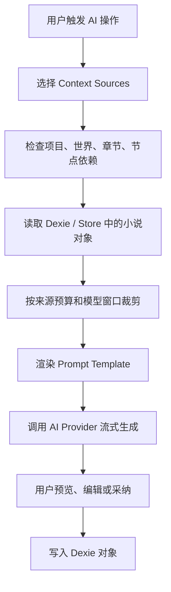

# StoryForge 参考项目现状分析

> 范围：本文只分析 `reference-only/storyforge` 本地当前版本的实际代码与仓库文档，用于理解 StoryForge 作为 OAN 早期灵感来源在当前阶段的真实形态。  
> 基准：本地 `reference-only/storyforge` 当前 HEAD 为 `f0389bb`，提交信息为 `Merge remote-tracking branch 'origin/main'`。本次为静态阅读，没有运行 StoryForge 的测试或构建。

## 结论概览

StoryForge 当前是一个 **纯前端、local-first、IndexedDB 驱动的小说 AI 创作工作台**。它不是 filesystem-first，也不是 Aider-style runtime；它把小说工程数据存在浏览器 IndexedDB 中，通过 React UI、Zustand store、Dexie schema、Prompt 模板、Context Source 注册表和 Adoption Schema 组织写作辅助流程。

它的核心优势不在“自动 Agent 代写一切”，而在于：

- 把 AI 写作过程拆成可见的 prompt 模板、上下文来源、工作流步骤和可采纳结果。
- 对长篇小说写作常见资产进行了较完整建模，包括世界观、故事核心、角色、章节、大纲、伏笔、状态卡、物品台账、时间线、资料库等。
- 为 AI 调用建立了较强的“读什么、写到哪里、怎么校验”的工程纪律。

但从实际代码看，StoryForge 当前仍主要是 **面板式 Copilot / workflow runner**，不是一个已经落地的通用 Chat Agent 或后台 Agent 系统。仓库中的 `AI-COPILOT-DESIGN.md` 描述了更完整的 ChatCopilot 与 Background Agents 设计，但那更接近未来方案，不等同于当前实现。

## 当前技术形态

StoryForge 的应用栈是典型浏览器端创作工具：

- 前端：React 19、Vite 6、TypeScript 5、Tailwind、TipTap。
- 状态管理：Zustand。
- 本地数据库：Dexie + IndexedDB。
- AI 接入：浏览器侧直接调用 OpenAI-compatible `/chat/completions` 接口，用户自行配置 provider、baseURL 和 API key。
- 流式输出：SSE streaming，带中断、重试、usage 记录和会话保持。
- 测试与工程约束：Vitest、TypeScript build、架构检查、AI manual 生成检查、required tables 检查。

StoryForge 没有独立 HTTP 后端，也没有文件系统对象树作为数据源。导入、导出、AI 运行记录和写作资产的主存储都围绕 IndexedDB 展开。

## 数据模型现状

StoryForge 的数据模型比普通写作编辑器要完整。当前代码中以 `PROJECT_TABLES` 注册项目表生命周期，覆盖约 45 类项目数据，包括：

- 项目与世界：`projects`、`worldGroups`、`worldviews`、`worldRulesProfiles`。
- 故事骨架：`storyCores`、`outlineNodes`、`detailedOutlines`、`storyArcs`。
- 正文与章节辅助：`chapters`、`emotionBeatCards`、`foreshadows`。
- 角色与关系：`characters`、`characterRelations`。
- 世界资料：`powerSystems`、`geographies`、`histories`、`historicalTimelineEvents`、`importantLocations`、`codexCategories`、`codexEntries`。
- 章节后状态：`stateCards`、`itemLedger`、`storyTimelineEvents`。
- 资料与导入：`references`、`referenceChunkAnalysis`、`importSessions`、`importJobs`、`importLogs`、`importFiles`。
- AI 与提示词：`promptTemplates`、`promptWorkflows`、`aiUsageLog`。

这一层的工程意义是：StoryForge 不只保存“章节正文”，而是把长篇小说写作拆成一组长期维护的领域对象。AI 写作时可以按对象取上下文，写作后也可以把新信息回填到对象中。

## AI 上下文机制

StoryForge 最值得注意的工程结构之一是 `CONTEXT_SOURCES + assembleContext`。

`context-sources.ts` 把可读上下文注册成命名来源，每个来源声明：

- key：如 `chapterOutline`、`detailedOutline`、`worldview`、`characters`、`foreshadows`、`stateCards`。
- scope：project / world / node / chapter / manual。
- layer：L0 到 L3。
- token budget。
- requirements：是否需要 `worldGroupId`、`outlineNodeId`、`chapterId` 等。
- read 函数：如何从 Dexie 和 store 中读出文本。

当前注册的来源包括：

- L0：手工文本、章节正文。
- L1：章节大纲、分卷大纲、详细大纲、上一章结尾、故事核心、创作规则、世界规则、情绪节拍。
- L2：世界观、力量体系、Codex、角色、历史、地点、伏笔、故事弧、状态卡、用户风格。
- L3：上下文备忘、引用资料等增强信息。

`assembleContext` 会根据调用输入选择来源、检查 requirements、读取文本、按单源预算截断、按模型上下文窗口计算总预算，并在超限时从低优先级层级开始丢弃来源。返回结果不只是拼好的文本，还包括 included / omitted / trimmed / totalInputTokens / inputBudget 等元信息。

这使 StoryForge 的 AI 调用有一个清晰模型：

## Prompt 与 workflow 系统

StoryForge 把 AI 能力拆成 PromptModuleKey，例如：

- 起书与故事设计：`story.generate`、`story.rules`。
- 世界观：`worldview.dimension`、`power-system.generate`、`geography.generate`。
- 角色：`character.generate`、`character.dimension`、`relation.extract`。
- 大纲：`outline.volume`、`outline.chapter`、`detail.scene`。
- 章节正文：`chapter.content`、`chapter.continue`、`chapter.polish`、`chapter.expand`、`chapter.de-ai`。
- 伏笔与整理：`foreshadow.generate`、`codex.extract`、`location.extract`、`story-timeline.extract`、`inventory.extract`。
- 导入与风格：`import.parse-chunk`、`reference.analyze`、`style.extract`。

Prompt 模板支持：

- system / user prompt 分离。
- `{{var}}` 变量替换。
- `{{#if var}}...{{/if}}` 条件片段。
- 模型参数配置。
- good / bad examples。
- 临时覆盖 system prompt / user prompt。
- “另存为我的版本”。

StoryForge 的 `PromptRunPanel` 让用户可以看见正在使用的模板、调整参数、临时修改 prompt，并把修改后的版本保存为用户模板。这与很多黑盒式写作工具不同：用户能看到 AI 是如何被指引的。

workflow 方面，StoryForge 有 `PromptWorkflow` 与 `WorkflowRunner`：

- workflow 由多个 step 组成。
- 每个 step 绑定一个 prompt module/template。
- step 可以带用户输入、参数覆盖、暂停确认、saveTarget。
- 前一步输出可以注入后一步。
- 部分 saveTarget 会通过 `adopt()` 写入世界观、故事核心、创作规则、角色、大纲、伏笔等对象。

当前内置 workflow 包括：

- “极速起书 · 通用”：故事核心、世界观、角色、分卷大纲、章节正文。
- “单章深度生成”：场景细纲、正文生成、润色、去 AI 味。
- “伏笔体系搭建”：世界观摘要、伏笔生成。

实际实现更像“可暂停的 prompt chain + 结构化保存”，还不是拥有自主计划、工具调用和长期记忆循环的 Agent runtime。

## 实际章节写作 workflow

以 `ChapterEditor` 为中心，StoryForge 的实际章节写作流程大致是：

1. 用户在章节编辑器打开某个 chapter，通常它关联一个 outline node。
2. 编辑器读取章节标题、章节摘要、大纲节点、详细大纲、世界观、故事核心、力量体系、Codex、创作规则、世界规则、历史、地点、伏笔、故事弧、情绪节拍、状态卡、引用资料、用户风格等上下文。
3. 生成正文时，另取上一章结尾约 500 字，角色上下文单独传入，避免与 full context 重复占用 token。
4. `buildChapterContentPrompt` 渲染章节正文 prompt。
5. `useAIStream` 调用 provider，流式输出正文。
6. 用户点击采纳后：
   - 生成 / 按报告修改：替换全文。
   - 续写：追加到现有正文。
   - 润色 / 扩写 / 去 AI 味：替换选区或近段内容。
7. 对生成 / 续写类操作，触发自动后处理：
   - 自动生成章节摘要，并直接更新 chapter.summary。
   - 自动抽取角色状态变化，形成 diff modal，等待用户确认后写入 stateCards。
8. 用户也可以手动触发状态抽取。
9. ReviewPanel 可对章节做结构审稿、AI 味检测、可读性 / 追读感分析。
10. 审稿报告可以作为修改指令输入，再由 AI 生成修订稿，用户预览后采纳。

需要注意的是：README 中描述的“状态表自动抽取角色 / 地点 / 物品 / 阵营变化、事件时间线、情绪节拍”等能力，比当前主流程代码更宽。当前 `state-extract-adapter.ts` 的实际规则更窄，主要抽取“已注册角色”的状态变化，并过滤非角色实体。

## 章节推进后的记录机制

StoryForge 已经具备多个章节后记录对象，但实际自动化程度不完全一致：

- `stateCards`：当前主流程中有明确的 AI diff 抽取、预览和确认应用。
- `chapter.summary`：生成 / 续写后会自动生成摘要并直接写回。
- `itemLedger`、`storyTimelineEvents`、`characterRelations`：有表、有 adoption schema、有 prompt module 或数据流设计，但并不都在当前章节生成后的统一自动 settlement 中落地。
- `foreshadows`：有生成、看板和状态设计；章节写作会读取开放伏笔，但章节后自动推进伏笔状态不是当前主流程的稳定闭环。
- `emotionBeatCards`：存在表和上下文来源；更多是章节辅助对象，并非所有章节后都会自动生成。

所以更准确地说：StoryForge 已经建立了“章节后结算”的对象基础和部分实现，其中角色状态 diff 是最明确的一条闭环；完整的章节 settlement agent 还停留在设计文档和分散能力阶段。

## 导入、资料与快照

StoryForge 有较完整的长文本导入管线：

- 把长篇资料或已有小说切块。
- 串行调用 AI 解析 chunk。
- 使用 rolling context 保持跨 chunk 连续性。
- 对世界观、角色、大纲等结构化结果做合并和去重。
- 导入过程可暂停、恢复、取消、记录日志。

它也支持生成 AI 可读的 context snapshot，把项目中的世界观、故事核心、力量体系、角色、大纲、章节结尾、开放伏笔等压缩成一份 Markdown 文本，用于后续 AI 调用。

这些机制说明 StoryForge 很重视“把已有小说工程压缩成可携带上下文”，这对长篇小说 Copilot 很关键。

## 功能特色

StoryForge 当前功能可以概括为：

- 系列级小说资产管理：多世界、世界观、角色、关系、Codex、地点、历史、力量体系。
- 分层写作辅助：故事核心、分卷大纲、章节大纲、详细场景、正文生成、续写、润色、扩写、去 AI 味。
- 伏笔系统：伏笔生成、状态、看板、紧急程度等。
- 三类质量检查：章节审稿、AI 味检测、可读性 / 追读感分析。
- 三层记忆思想：工作上下文、章节后状态、长期语义资产。
- Prompt 可见化：模板、参数、变量、examples、临时覆盖、另存版本。
- workflow chain：把起书、单章生成、伏笔搭建等流程串成可暂停步骤。
- 导入 pipeline：长篇文本切块解析和结构化采纳。
- 工程自检：生成式 AI manual、架构 lint、required tables 检查、测试矩阵。

## 值得肯定的工程优点

1. **AI 读写边界清楚**  
   `CONTEXT_SOURCES` 负责读，`FIELD_REGISTRY + AdoptionSchema` 负责可写目标，`PROJECT_TABLES` 负责表生命周期。虽然它是 IndexedDB 架构，但这种分层很适合复杂 AI 写作产品。

2. **Prompt 系统不黑盒**  
   用户能看见、临时修改、保存自己的 prompt 模板。对小说写作这类高度风格化任务，这是实用优势。

3. **上下文预算可解释**  
   每个来源有 layer 和 budget，最终 assemble 结果能说明哪些被包含、哪些被省略、哪些被裁剪。这比简单拼接全文更可靠。

4. **章节后状态有 diff 思维**  
   状态卡不是直接静默覆盖，而是通过 diff modal 让用户确认。这接近 OAN 需要的人类确认工作流。

5. **AI 能力目录化**  
   StoryForge 通过 PromptModuleKey、AI call category、generated manual 把 AI 功能做成可盘点资产，降低了“代码里到处散落 prompt”的失控风险。

6. **导入与写作是同一个资产模型**  
   导入不是单纯把文本塞进编辑器，而是解析为世界观、角色、大纲、资料等结构对象，这对吸收已有作品或设定集很有价值。

## 当前限制与风险

1. **不是 filesystem-first**  
   StoryForge 的数据库是 IndexedDB。它适合作为浏览器本地工具，但不符合 OAN “Markdown / YAML / Object File Tree 是数据库”的稳定事实。

2. **没有 Git diff 级人类确认**  
   StoryForge 有 UI 预览、adopt 校验和部分 diff modal，但不是对真实目标文件生成 Git diff 后确认。某些结果，例如章节摘要，会在 AI 后处理后直接写入 IndexedDB。

3. **Agent 设计大于当前实现**  
   ChatCopilot、Background Agents、Tool Registry 在文档中已经设计得较完整，但当前代码主要还是 prompt panel、workflow runner 和局部 AI 功能。

4. **章节 settlement 未完全闭环**  
   当前最稳定的是角色状态 diff。物品、时间线、关系、伏笔推进等有对象和部分能力，但没有全部接入统一的章节后结算流水线。

5. **文档与代码存在轻微漂移**  
   部分文档仍提到 39 tables，而当前 `PROJECT_TABLES` 约为 45；README 对自动抽取范围的描述也比实际主流程更宽。使用时应以代码为准。

6. **许可证状态不清晰**  
   README 显示 License TBD。本仓库只能把 StoryForge 作为设计参考，不能直接复制其实现或 prompt 文本。

## 与 OAN 的定位差异

StoryForge 和 OAN 的共同点是都面向长篇小说 AI Copilot，都关心世界观、角色、大纲、状态、伏笔和章节推进。

但二者底层哲学不同：

- StoryForge：浏览器 local-first，IndexedDB 是数据库，UI 面板与 Dexie schema 是中心。
- OAN：filesystem-first，Markdown / YAML / Object File Tree 是数据库，Git 是历史引擎，AI 是 Copilot，真实写入必须经过人类确认。

因此 StoryForge 更适合被 OAN 吸收为：

- AI 写作上下文组织方式参考。
- Prompt 与 workflow 可视化参考。
- 长篇小说对象模型参考。
- 章节后结算与质量检查参考。
- AI 能力目录化和工程自检参考。

不适合作为 OAN 的直接架构模板。OAN 不应把 IndexedDB、直接写库、浏览器内 provider secret 管理、或未确认的后台自动 agent 搬过来。

## 主要证据路径

- `reference-only/storyforge/README.md`
- `reference-only/storyforge/package.json`
- `reference-only/storyforge/docs/ARCHITECTURE.md`
- `reference-only/storyforge/docs/AI-COPILOT-DESIGN.md`
- `reference-only/storyforge/docs/MASTER-BLUEPRINT.md`
- `reference-only/storyforge/docs/DATA-FLOW-MAP.md`
- `reference-only/storyforge/docs/CONSISTENCY-CHECK-DESIGN.md`
- `reference-only/storyforge/docs/AI-FUNCTIONS-MANUAL.generated.md`
- `reference-only/storyforge/src/lib/registry/context-sources.ts`
- `reference-only/storyforge/src/lib/registry/assemble-context.ts`
- `reference-only/storyforge/src/lib/registry/adopt.ts`
- `reference-only/storyforge/src/lib/registry/adoption-schema.ts`
- `reference-only/storyforge/src/lib/registry/field-registry.ts`
- `reference-only/storyforge/src/lib/registry/project-tables.ts`
- `reference-only/storyforge/src/components/editor/ChapterEditor.tsx`
- `reference-only/storyforge/src/components/editor/ReviewPanel.tsx`
- `reference-only/storyforge/src/components/settings/prompt/WorkflowRunner.tsx`
- `reference-only/storyforge/src/components/shared/PromptRunPanel.tsx`
- `reference-only/storyforge/src/lib/ai/prompt-engine.ts`
- `reference-only/storyforge/src/lib/ai/workflow-seeds.ts`
- `reference-only/storyforge/src/lib/ai/context-budget.ts`
- `reference-only/storyforge/src/lib/ai/adapters/chapter-adapter.ts`
- `reference-only/storyforge/src/lib/ai/adapters/state-extract-adapter.ts`
- `reference-only/storyforge/src/lib/ai/adapters/review-adapter.ts`
- `reference-only/storyforge/src/lib/import/pipeline.ts`
- `reference-only/storyforge/src/lib/import/chunk-writer.ts`
- `reference-only/storyforge/src/lib/export/context-snapshot.ts`
